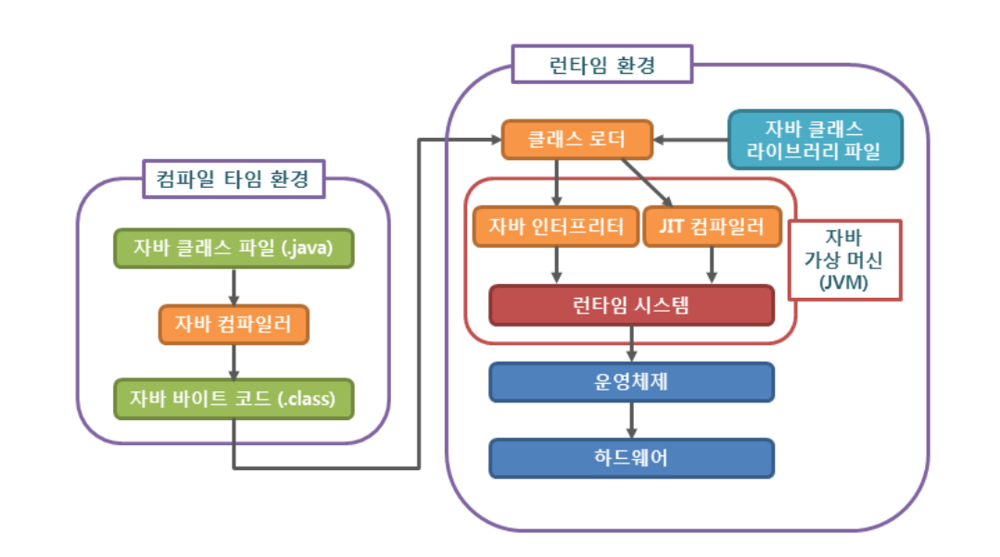
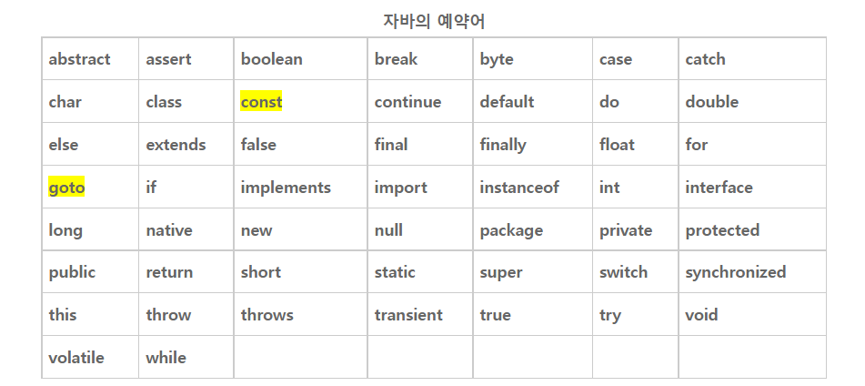

# Java_Intro

## 개요

> Java

- 객체지향언어

  - 객체를 만들고 조작하며 객체끼리 관계를 맺음으로 다수의 객체가 함께 수행될 수 있게 함.
  - 특징
    - 상속, 캡슐화, 다형성, 추상화

  - 장점
    - 재사용성, 생산성 향상, 자연적인 모델링, 유지보수의 우수성

  - 단점
    - 개발 속도 느림, 실행속도 느림, 코딩 난이도 상승


> 자바 프로그래밍



- Java compiler

  - 자바 컴파일러는 자바를 가지고 작성한 자바 소스 코드를 자바 가상 머신이 이해할 수 있는 자바 바이트 코드로 변환

  - 자바 컴파일러는 자바를 설치하면 javac.exe라는 실행 파일 형태로 설치됩니다.

- JRE

  - JVM을 생성하는 디스크 상의 부분
  - JRE는 자바 코드를 실행하기 위한 도구들로 구성된 패키지
  - 자바 프로그램을 구동하기 위한 독립형 구성요소로써 사용될 수도 있지만, 동시에 JDK의 일부

- JDK (Java Development Kit)

  - 개발자들이 JVM과 JRE에 의해 실행되고 구동될 수 있는 자바 프로그램을 생성할 수 있게 해줌
  - 자바 기반 소프트웨어를 개발하기 위한 도구들로 이뤄진 패키지


> 자바 프로그램

- 한 개 이상의 클래스(class)로 구성

- 이러한 클래스는 한 개 이상의 필드(field)나 메소드(method)로 구성

- main() 메소드

  - 자바 프로그램이 실행되면 맨 먼저 main() 메소드를 찾아 그 안의 모든 명령문을 차례대로 실행
  - 자바 프로그램에는 main() 메소드를 가지는 클래스가 반드시 하나는 존재
  - 반드시 public static void로 선언

  ```java
  public class 파일명 {
      public static void main(String[] args) {
  
          ...
  
      }
  }
  ```

- 자바의 모든 명령문은 반드시 세미콜론(;)으로 끝나야함


> `System.out.println(출력할 데이터);`

- 자바 표준 입출력 클래스
- 모니터에 전달된 데이터를 출력한 후에 줄 바꿈까지 해줌
- System.in : 표준 입력 작업
- System.out
- System.err
- println() 메소드와는 달리 print() 메소드는 전달된 데이터를 출력한 후에 줄 바꿈을 하지 않음


## 타입

### 변수

> 변수란?

- 데이터(data)를 저장하기 위해 프로그램에 의해 이름을 할당받은 메모리 공간을 의미


> 자바에서의 변수 규칙

- 변수의 이름은 영문자(대소문자), 숫자, 언더스코어(_), 달러($)로만 구성
- 숫자로 시작할 수 없음
- 공백 X
- 미리 정의된 키워드(keyword) X




> 변수 종류

- 기본형 변수 = 실제 연산에 사용되는 변수
  - 정수형 : byte, short, int, long
  - 실수형 : float, double
    - float형 타입이 소수 6자리까지는 정확하게 표현할 수 있으나, 그 이상은 정확하게 표현하지 못함
    - double형 타입은 소수 부분 15자리까지 오차없이 표현
  - 문자형 : char
    - 유니코드(unicode)를 사용하여 문자를 표현
    - 아스키코드는 영문자와 숫자밖에 표현 못 하지만, 유니코드는 각 나라의 모든 언어를 표현
  - 논리형 : boolean
    - 기본값은 false
- 참조형 변수
  - 8개의 기본형 변수를 사용하여 사용자가 직접 만들어 사용하는 변수를 의미


> 선언

- 반드시 먼저 변수를 선언하고 초기화


1. 선언만 하기
   - 자바에서는 프로그램의 안전성을 위해 초기화하지 않은 변수는 사용할 수 없도록 하고 있습니다.
   - 만약 초기화되지 않은 변수를 사용하려고 하면, 자바 컴파일러는 오류를 발생

```java
public class test {
	public static void main(String[] args){
    int num;
	num = 20; // 변수의 초기화
    System.out.println(num); // 20
	}
}
```

2. 선언과 동시에 초기화
   - 여러 변수를 동시에 초기화할 수는 없음

```java
public class test {
	public static void main(String[] args){
    int num1, num2;                  // 같은 타입의 변수를 동시에 선언함.

    double num3 = 3.14;              // 선언과 동시에 초기화함. (double = 실수형)

    double num4 = 1.23, num5 = 4.56; // 같은 타입의 변수를 동시에 선언하면서 초기화함.
    System.out.println(num3);
        
   	num1 = 1, num2 = 4; // 하지만 이미 선언된 여러 변수를 동시에 초기화할 수는 없음.
	}
}
```


### 상수

> 상수란? in JAVA

- 프로그램이 실행되는 동안 메모리에 저장된 데이터를 변경할 수 없다
- 선언과 동시에 반드시 초기화
- final 키워드를 사용하여 선언
- 자바에서 상수의 이름은 일반적으로 모두 대문자를 사용하여 선언
- 여러 단어로 이루어진 이름의 경우에는 언더스코어(_)

```java
public class test {
	public static void main(String[] args){
    final int AGES = 30;
    System.out.println(AGES);
	}
}
```


### 타입 변환 in Java

> 하나의 타입을 다른 타입으로 바꾸는 것

- boolean을 제외한 나머지는 다 가능
- 피연산자들을 모두 같은 타입으로 만든 후에 수행


> 묵시적 타입 변환(자동 타입 변환)

- 대입 연산이나 산술 연산에서 컴파일러가 자동으로 수행해주는 타입 변환

```java
public class test {
	public static void main(String[] args){
    double num1 = 10; // 실수형을 선언하고 int를 넣는 건 가능

    // int num2 = 3.14; // => 오류 발생

    double num3 = 7.0f + 3.14;
    System.out.println(num1);
    System.out.println(num3);
	}
}
```


> 명시적 타입 변환(강제 타입 변환)

- 사용자가 타입 캐스트 연산자(())를 사용하여 강제적으로 수행하는 타입 변환

- 문법

  `(변환할타입) 변환할데이터`

```java
public class test {
	public static void main(String[] args){
    int num1 = 1, num2 = 4;
    double result1 = num1 / num2;
    double result2 = (double) num1 / num2;    

    System.out.println(result1); 	// 0.0
    System.out.println(result2);	// 0.25
	}
}
```

