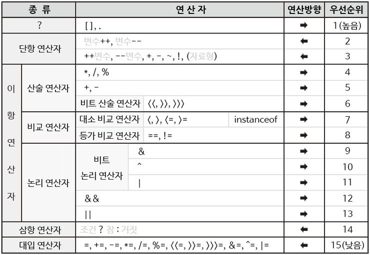

# JAVA_intro

 ## JAVA 특징
   - 플랫폼에 독립적 (JVM : java로 만들어진 프로그램을 실행해주는 프로그램)
   - 객체지향 프로그래밍
     - 재활용성
     - 직관성
   - Garbage Collector : 메모리 관리
  
 ## JAVA 개발 환경
   - JDK 설치 (Java Development Kit)
   - 환경변수 설정
     - JAVA_HOME
     - CLASSPATH
     - PATH
   - IDE 설치

 ## JAVA 개발 순서
   - 코드 작성 -> Compile -> JVM으로 실행
   `IDE없이 cmd로 compile : javac ~.java / 실행 : java ~`
   - Compiler
     - 작성한 코드를 실행가능한 코드로 변환하는 프로그램 (Language Code to Machine Code)


 ## 변수와 계산
  ### 변수
   - 값(data)을 저장할 수 있는 메모리 공간
   - type
     - 문자리터럴 : char
     - 실수리터럴 : float, double
     - 정수리터럴 : int, long, char, short, byte
     - 논리리터럴 : boolean
     `리터럴 : 특정한 값 자체`
   - 식별자 : 변수의 이름
   - 명명규칙 : 첫번째 문자 `소문자`, `camelCase`
   - 변수의 scope : 변수를 선언한 위치에 따라 사용할 수 있는 범위가 달라짐
  
  ### 상수
   - 변수처럼 값을 저장할 수 있는 메모리 공간
   - but, 한번 저장한 값은 변경 불가
   - `final` 
   - 명명 규칙 : `대문자`, `SNAKE_CASE`
   - 값의 변경이 크리티컬한 case에 사용

  ### 기본형의 타입변환
   - 묵시적 형변환 : 범위 작은 타입 -> 큰 타입 변환 가능
   - 강제(명시적) 형변환 : 큰 타입 -> 작은 타입
    ```java
      long x = 5L;
      int y = (int) x;
    ```
  ### 연산자와 연산식
   - 연산 : 데이터를 처리하여 결과를 산출하는 것
    `x = y + z` : 연산식
    => =, + : 연산자 (연산에 사용되는 표시나 기호) == Operations
    => y, z : 피연산자 (연산대상이 되는 데이터 리터럴,변수) == Operand
   - 연산자
     - 부호 연산자 : +, -
      `변수 앞에 부호연산자 붙는경우, + : 부호비트 유지 / - : 음수 및 양수 변환`
     - 산술 연산자 : +, -, /, %, *
     - 증감 연산자 : ++ , -- 
      `후위연산자 ++8 : 8+1 / 전위연산자 8++ : 값 먼저 변수에 대입 후, +1`
     - 비교 연산자 : ==, !=, <, >, <=, >= (결과값 : boolean)
     - 복합 대입 연산자 : +=, -=, *=, /=
     - 논리 연산자 : &&, ||, !, ^(exclusive or)
   - 연산자 우선순위
     
  
 ## 조건문
   - 수행하고자 하는 코드 제어
  ### If
   - if/ else if/ else
  
  ### 삼항 연산자
  ```java
    (x < y) ? true : false;
  ``` 
  ### Switch
   - switch/ case/ default/ break
   - case : 처음 만난 case부터 쫙 실행 => break로 컨트롤
   - default : else 와 같은 역할
  ```java
    int value = 1;

    switch (value) {
      case 1 :
        System.out.println("1입니다.");
        break; // 아래 case 실행X
      case 2 : case 3 :
        System.out.println("2보다 크거나 같고 4보다 작습니다.");
      case 4 :
        System.out.println("4입니다.");
      default :
        System.out.println("끝.");
    }
  ```

 ## 반복문
  ### while
   - 조건이 만족되지 않을 때 수행 X
  
  ### do while
   - 무조건 1번은 수행
   ```java
    int value = 0;
    // java.util 패키지 안에 만들어져있는 Class (~로부터 값을 입력받고 싶을때 사용)
    Scanner scan = new Scanner(System.in); // System.in : 키보드 입력 값

    do {
      // 맨 처음 실행 후, while에서 조건이 맞으면 do로 와서 반복
      // 반복할 문장들
      value = scan.nextInt(); 
    } while (value != 10);
   ```

  ### for
   - 구문 자체에 변수 초기화, 조건식, 증감식이 한줄로 표현
   ```java
    int value = 0;
    
    for (int i=0; i<10; i++) {
      if (i%2 == 0) {
        value ++;
        continue; // 아래 문장 실행 않고 바로 다시 for문 돌리기
      }
      value -= 1;
    }
   ```
  
  ### for each
   - for (타입 값을 받아줄 변수명 : 출력하고 싶은 자료구조)
  ```java
    int [] array1 = {1, 2, 3, 4};
    // 일반 for문
    for (int i=0; i<array1.length; i++) {
      int value = array1[i];
      System.out.println(value);
    }
    // for each 문
    for (int value:array1) {
      System.out.println(value);
    } 
  ```

 ## 배열
   > 변수가 많아져 하나하나 선언하기 힘든 경우 사용 (참조형 타입)
  ### 1차원 배열
  ```java
    // [] : 배열을 나타냄, new : 배열 생성 시 사용
    // 배열안의 정수 갯수 (100개) -> 배열 크기는 처음 선언 후 변경 X
    int[] array1 = new int[100];
    array1[0] = 50;

    // 선언과 동시에 배열크기 및 값 넣기
    int[] array2 = new int[]{1, 2, 3, 4}; 
    int[] array3 = {1, 2, 3, 4};

    System.out.println("배열의 길이는 length" + array1.length)
  ```

  ### 2차원 배열
   > 배열의 배열
  ```java
    int[][] array1 = new int[3][4]; // 3행 4열
    array1[0][1] = 10;

    // 크기가 다른 배열 생성도 가능 
    int[][] array2 = new int[3][]; // 값을 담을 수 있는 1차원 배열 만들어지지 않음
    array[0] = new int[2]; // 값을 담을 배열을 선언해줘야 아래 값을 담을 수 있음
    array[0][2] = 10; 

    // 선언과 동시에 값 넣기
    int[][] array3 = {{1}, {1,2}, {1,2,3}};
  ```
  

 ## Python 과 차이
   1. 참/거짓
    - python : 0은 false/ 나머지 true
    - java : 불가
   2. 값 비교 범위
    - python : 1 < 변수 < 10
    - java : 변수 > 1 && 변수 < 10
   3. 반복문
    - python : for i in range(1, 3) :
    - java : for (int i=0; i<3, i++) {
             }
   4. 함수
    - 길이
      - python : len(value)
      - java : value.length

    