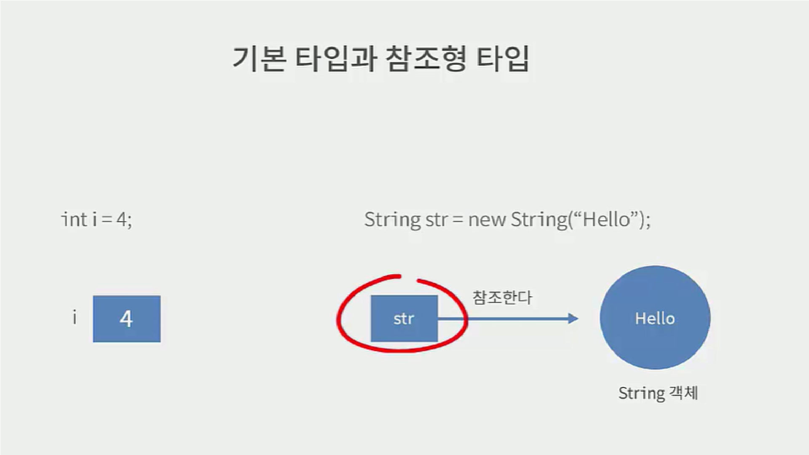
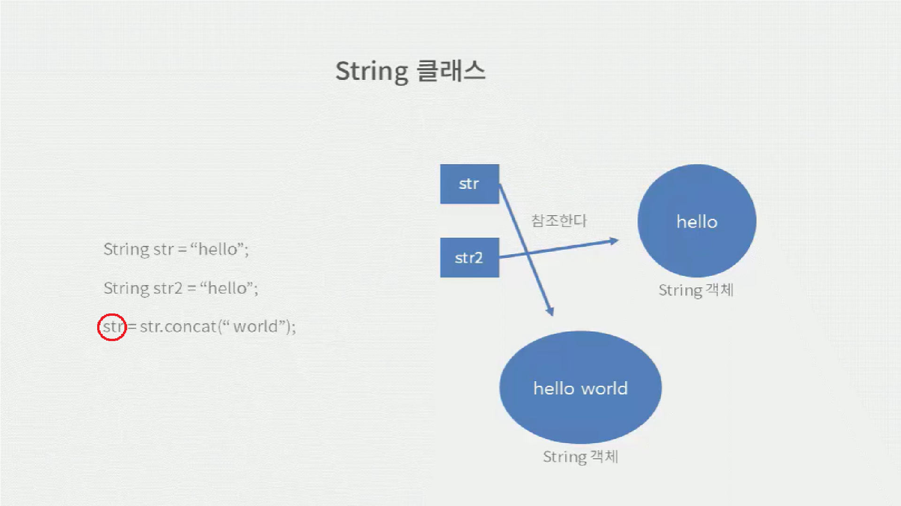

# JAVA Class

 ## 객체지향언어
  > 프로그램을 구성하는 요소는 객체이며, 이것이 상호작용하도록 프로그래밍
   - Java는 객체를 만들기 위해 반드시 Class를 먼저 만들어야함
  ### Class
  > 객체를 만들기위한 틀
   ex. 붕어빵 : 객체, 붕어빵만들어내는 틀 : 클래스
   - 선언
  ```java
    public class 클래스명 { // 클래스 블록
      ... 
    }
  ```
   - class 파일 생성 후 저장 시, eclipse가 compile하여 car라는 class 생성
   - class를 이용해 객체를 만들 때, class가 모든 참조형 타입이 될 수 있다
  ```java
    public class CarExam {
      public static void main(String[] args) {
        Car c1 = new Car();
      }
    }
  ```
   - `new` 연산자 
   > class를 메모리에 올려주세요~!
     - new 뒤에 나오는 생성자를 이용해 메모리에 객체를 만들라는 명령어
     - `인스턴스` : 메모리에 만들어진 객체 
     - 만들어진 객체를 참조하는 객체 : `c1`
  
   - 참조형 타입
  ```java
    public class TypeClass {
      public static void main(String[] args) {
        // 정수 i라는 기본형 변수에 4 저장
        int basic = 4; 
        // String Class 
        /* str : 메모리에 올라간 instance를 가르키는 변수 (참조하는 변수, 레퍼런스하는 변수)
          즉, 변수가 instance를 가지고 있는 것이 아니라 말 그대로 가르킨다. (str에 메모리의 위치값 저장됨)
          str은 다른 메모리에 저장됨 */
        String str = new String("hello");
      }
    }
  ```
  

  ### String Class
   > java에서 가장 많이 사용되는 문자열을 표현하는 클래스
    - new 연산자 이용하지 않고도 인스턴스 생성가능 (이용해도 됨)
    - 한번 생성된 Class의 내부의 값은 변하지 않는다 == 불변 Class
      (다른 class는 아님)
    - String이 가지고 있는 메서드들은 String 값 반환
      - 실행 후, 새로운 String을 만들어서 반환
  ```java
    public class StringClass {
      public static void main(String[] args) {
        // 1.
        // new연산자 사용 X
        // hello문자들이 상수가 저장되는 메모리 영역에 저장
        /* str1에서 hello가 상수영역에 변하지않는 값으로 저장되어
          str2는 똑같은 인스턴스 생성하지 않고 해당 인스턴스 참조 
          즉, str1과 str2는 같은 인스턴스를 참조함  */ 
        String str1 = "hello";
        String str2 = "hello"; 

        // 2. 
        // new연산자 사용
        /* 상수영역을 참조하지 않고 새로 인스턴스를 heap영역에 생성
          즉, str3과 str4는 heap영역에 각각 저장  */
        String str3 = new String("bye");
        String str4 = new String("bye");

        // 참조형은 값 비교X
        // == : 실제 변수가 가르키고 있는 메모리영역의 주소 비교
        // equals : 두 문자열이 같은지 비교하는 String Class Method
        if (str1 == str2) {
          System.out.println("같은 레퍼런스");
        }
        if (str2 == str3) {
          System.out.println("다른 레퍼런스");
        }
        if (str3 == str4) {
          System.out.println("다른 레퍼런스");
        }

        System.out.println(str1.substring(2));
        System.out.println(str1); // 위에서 값을 잘라도 str1 값은 변하지 않는다.
      }
    }
  ```
  
  ### Field
  > 객체의 속성 (상태)
   - 예시
     - 객체 : Car
     - 속성(field) : 자동차의 이름, 번호
       (객체별로 속성의 값이 유지된다)
     - 메서드(Method) : 전진, 후진 
   - 필드 선언
  ```java
  // Car class
    public class Car {
       // 타입 필드명
       String name;
       int number;
    }
  // CarExam Class
    public class CarExam {
      // Car라는 객체가 c1, c2 두 개 메모리상에 만들어짐
      // 각각 name, number라는 속성 가지게 됨
      Car c1 = new Car();
      Car c2 = new Car();

      c1.name = "제네시스";
      c2.name = "아방이";
    }
  ```

  ### 메서드
  > 객체의 행동 (Class가 가지고 있는 기능)
   - 입력값을 받아 동작한 후 그 결과값을 도출
   - 입력값 == 매개변수(parameter) == 인자(Argument)
     - 인자 : 어떤 함수를 호출시에 전달되는 값
     - 매개변수 : 전달된 인자를 받아들이는 변수
   - 결과값 == 리턴값
   - 메서드 형태
     - void : 리턴값이 없는 경우
     - 리턴타입 : int, String, 
  ```java
    public class MyClass {
      // public 리턴타입 메소드명(매개변수) { 기능구현 }
      public String method1(int x) {
        String result = "hello";
        System.out.println("매개변수는 " + x);

        return result;
      }
    }
  ```
   - 메서드 사용
    > 클래스가 가진 메서드를 사용하기 위해서는 `객체`로 만들어야 사용가능
  
  ### String Class Method
   - 변수.length() : 문자열의 길이
   - 변수.concat() : 문자열 + 문자열 (결합)
   - 변수.substring() : 문자열 자르기
  

  ### 변수의 scope 와 static
   - 모든 클래스는 인스턴스화 하지 않으면 사용 불가능!
   - static
     - class를 정의하고 해당 클래스를 new(인스턴스화) 하지 않았음에도 main 메서드가 실행되는 이유
     - 즉, static을 사용하면 클래스가 인스턴스화하지 않아도 `static한 메서드나 필드` 사용 가능!
     - 객체를 생성하지 않아도 사용가능하기 때문에, static한 메서드내에서 static하지 않은 필드는 사용 불가능
   - static 변수 == class 변수
       - static한 필드는 인스턴스 생성시에 만들어지지 않고, 값을 저장할 수 있는 공간이 하나임
       - 즉, 값을 공유함
   - 인스턴스 변수 : 인스턴스가 생성될 때 만들어지는 변수
  ```java
    public class VariableScopeExam {
      int globalNum = 10; // 인스턴스 변수
      static int staticNum = 50; // 클래스 변수

      public void scopeTest(int value) {
        int localNum = 20; // 지역변수
        System.out.println(globalNum + localNum);
      }

      public void scopeTest2(int value) {
        int testNum = 30;
        System.out.println(localNum + testNum); // localNum 은 범위 밖이여서 사용 불가능
        System.out.println(staticNum); // 가능
      }

      public static void main(String[] args) {
        System.out.println(globalNum); // globalNum 도 사용 불가능
        System.out.println(staticNum); // static한 메서드 내, static 필드는 사용 가능!!!

        // static 메서드 내, static하지 않은 필드 사용하는 방법
        // Class화 하여 사용
        VariableScopeExam v1 = new VariableScopeExam();
        System.out.println(v1.globalNum);
        /*
          클래스 변수는 
            클래스.클래스변수명 
          으로 사용하는 것이 바람직
        */
        System.out.println(v1.staticNum);
        System.out.println(VariableScopeExam.staticNum);
      }
    }
  ```

  ### 열거형
  > java는 열거 타입을 이용해 변수선언 시 변수타입으로 사용
   - jdk5에서 추가됨
   - 이전에는 static final 상수를 이용해 열거형태로 사용
   - enum 이름 {값1, 값2;}
  ```java
    public class EnumExam {
      public static final String MALE = "MALE";
      public static final String FEMALE =  "FEMALE"

      public static void main(String [] args) {
        String gender1;
        Gender gender2; // 열거형 타입이 됨

        gender1 = EnumExam.MALE;
        gender1 = EnumExam.FEMALE;
        gender1 = "boy"; 

        gender2 = Gender.MALE;
        gender2 = Gender.FEMALE;
        gender2 = "boy"; // 에러발생!!
      }
    }
    /*열거형
      특정 값들만 넣고 싶을때 사용 (즉, 상단 boy와 같은 값을 넣고 싶지 않음)
    */
    enum Gender {
      MALE, FEMALE;
    }
  ```