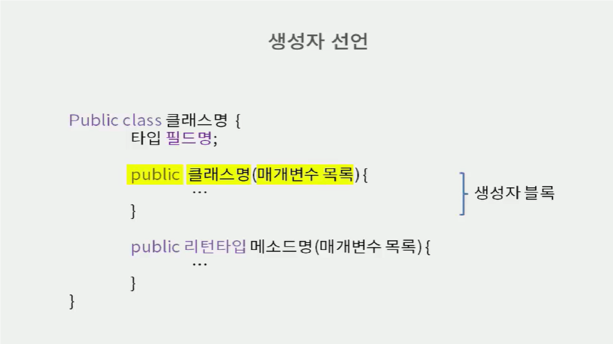
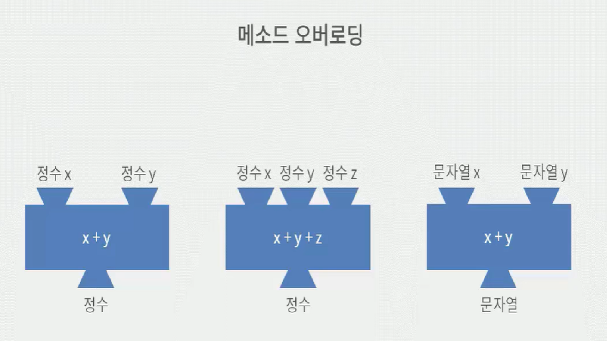
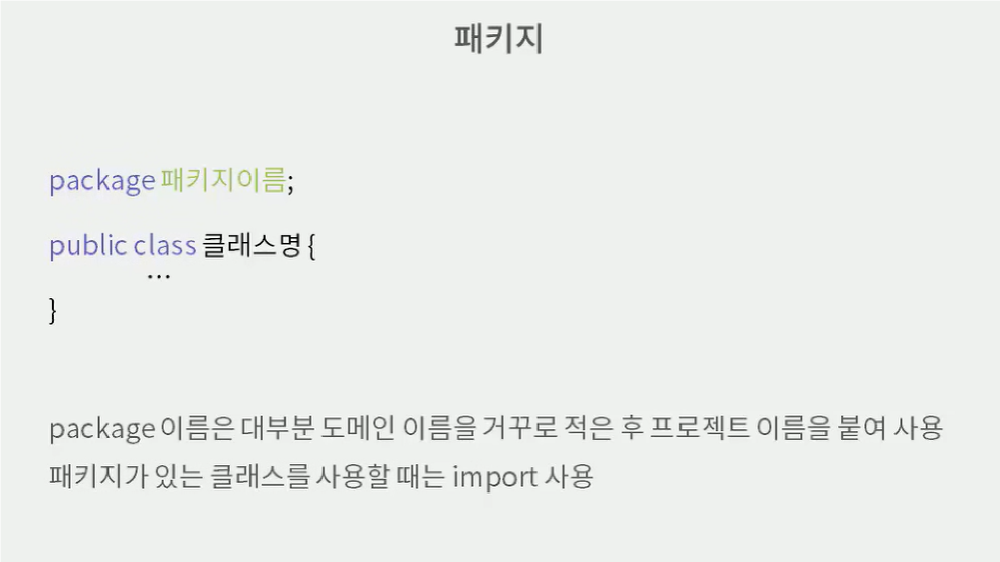

# JAVA 생성자

 ## 생성자 특징
 > 객체가 될때 필드를 초기화하는 역할
   - 리턴타입 존재 X
   - 생성자를 만들지 않으면 매개변수가 없는 생성자가 compile할때 자동으로 만들어짐
   - 기본 생성자 : 매개변수가 없는 생성자
 
  ```java
  // Car Class
    public class Car {
      String name;
      int number;

    // Car 객체가 만들어질때 반드시 이름을 가지고 만들고 싶다면 하기 생성자로 가능
    // 즉, 매개변수가 있는 생성자
    public Car(String name) {
      /* this
        객체 자신을 참조 (객체 자신의 field를 바라봄)
        class 안에서 자기 자신이 가지고 있는 속성/메서드/생성자 등을 의미
      */
      this.name = name;
    }

  // CarExam Class
    public class CarExam {
      Car c1 = new Car(); // 기본 생성자 -> 사용불가!
      Car c2 = new Car("붕붕이");
    }
  }
 ```

 ## 오버로딩
  ### 메서드 오버로딩
  > 매개변수의 갯수나 타입이 다르지만 비슷한 기능을 하는 
   메서드가 여러개 일때 동일한 이름으로 메서드 여러개 정의 가능 
   - `매개변수의 타입이나 수`가 달라야 가능
  
  
  ### 생성자 오버로딩
  > 메서드와 마찬가지로 매개변수의 수와 타입이 다르다면 동일 이름의 생성자 여러개 선언 가능


 ## 패키지
 > class 관리를 위해 사용
   - 관련된 class들을 폴더별로 관리
   - 도메인 붙여서 사용 
      => 다른 프로젝트, 회사에서 만든 파일명과 중복되지 않기 위해
   - 폴더명은 숫자로 시작 불가!
   - `import` : java의 lang 패키지를 제외하고 모든 패키지는 import 기재
     > 다른 패키지의 class를 사용하기 위한 키워드
 

 ## 상속
