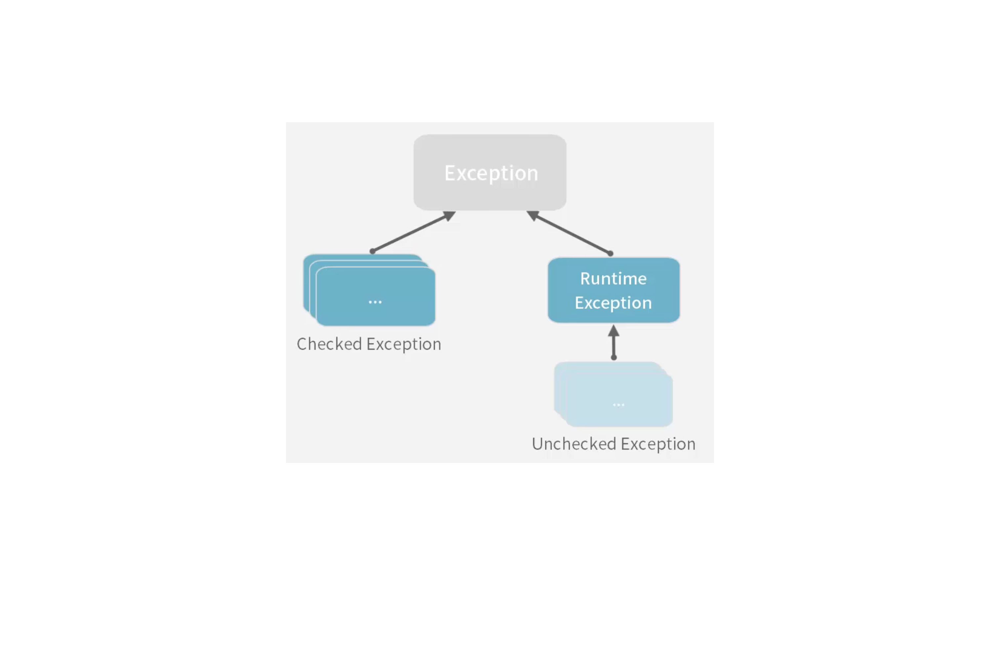

# 예외처리

 ## try-catch-finally
 - try {} catch(예외클래스 변수명) {} finally {}
 - finally
   - 생략가능
   - 예외발생 여부에 상관없이 반드시 실행되는 블록


 ```java
    public class ExceptionExam {
      public static void main(String[] args) {
        int x = 20;
        int y = 0;
        
        try {
          int z = x/y;
          System.out.println("x 나누기 y == " + z);
        }
        catch (ArithmeticException e) {
          System.out.println("예외발생" + e.toString());
        }
        finally {
          System.out.println("무조건 실행됨");
        }
      }
    }
 ```

 ## throws & throw
   ### throw
    - throws와 같이 시용

 ```java
    public class ExceptionExam2 {
      public static void main(String[] args) {
        int x = 10;
        int y = 0;

        try {
          int z = divide(x, y);
          System.out.println("나누기 결과 == " + z);
        }
        catch(IllegalArgumentException e) {
          System.out.println("예외발생" + e.toString());
        }
      }

      // 예외처리를 divide에서 하지 않고 호출한 쪽에서 예외처리 구현하도록 함 (여러 오류처리 넘길 수 있음)
      // ex. throws ArithmeticException, ClassCastException
      // throws exception : 어떤 오류든 다 넘김
      public static int divide(int num1, int num2) throws IllegalArgumentException {
        int result;

        if (num2 == 0) {
          // java가 가지고 있는 exception 객체 사용하여 에러 처리
          throw new IllegalArgumentException("0으로 나눌 수 없습니다.");
        }
        result = num1/num2;
        return result;
      }
    }
 ```

 ## 사용자 정의 Exception
 

 - 사용자가 직접 exception을 정의해서 사용 가능
 - 클래스 이름만으로 어떤 오류가 발생했는지 알려주어 코드의 `직관성`을 높임

  ### Checked Exception
   > Exception을 상속받은 클래스
   - 오류처리를 하지 않으면 compile에러 발생 (반드시 에러처리 필요)
  
  ### Runtime Exception
   > 오류처리 필수는 아님

  ```java
    // checked exception
    public class OriginBizException extends Exception {
      public BizException(String msg) {
        super(msg);
      }
    }

    // unchecked exception 생성
    public class BizException extends RuntimeException {
      // exception 객체에서는 생성자만 지정해주면 됨
      public BizException(String msg) {
        super(msg);
      }
      public BizException(Exception ex) {
        super(ex);
      }
    }

    public class BizService {
      public void bizMehtod(int x) throws BizException {
        System.out.println("비즈니스 시작");

        if (x < 0) {
          throw new BizException("비즈니스 에러");
        }

        System.out.println("비즈니스 종료");

      }
    }

    public class BizExam {
      public static void main(String[] args) {
        BizException biz = new BizService();
        biz.bizMethod(-10);
        // try-catch 안해도 runtime exception 이므로, compile error 발생 안함
      }
    }
  ```