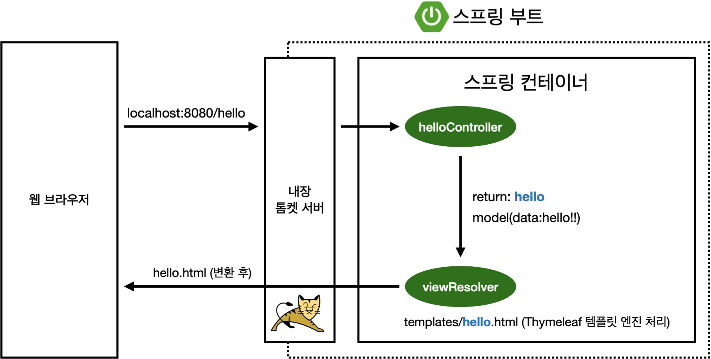

# SPRING INTRODUCTION
 ## Start Spring
   - spring.io : 스프링 부트 기반으로 프로젝트 만들어주는 사이트
   - maven/gradle : 필요한 라이브러리를 땡겨오고, 빌드하는 라이프사이클까지 다 관리해주는 툴
     - 의존관계를 관리
   - dependencies : 스프링 부트 기반 프로젝트를 어떤 라이브러리를 땡겨서 쓸건지
   - Thymeleaf : html을 만들어주는 탬플릿 엔진
   - Spring Boot : 톰캣과 웹서버 내장

    ### 라이브러리
     - spring-boot-starter-web
       - spring-boot-starter-tomcat: 톰캣 (웹서버)
       - spring-webmvc: 스프링 웹 MVC
       - spring-boot-starter-thymeleaf: 타임리프 템플릿 엔진(View) 
       - spring-boot-starter(공통): 스프링 부트 + 스프링 코어 + 로깅
         - spring-boot : spring-core
         - spring-boot-starter-logging : logback, slf4j
     - spring-boot-starter-test
       - junit: 테스트 프레임워크
       - mockito: 목 라이브러리
       - assertj: 테스트 코드를 좀 더 편하게 작성하게 도와주는 라이브러리
       - spring-test: 스프링 통합 테스트 지원
     - 참고: `spring-boot-devtools` 라이브러리를 추가하면, `html` 파일을 컴파일만 해주면 서버 재시작 없이 View 파일 변경이 가능
    
    ### Welcome Page
    > 도메인만 누르고 들어왔을 때, 첫 화면 
     - 스프링 부트는 resources/static/index.html에 넣어두면 자동으로 welcome page로 인식
     - 정적 페이지
       - 파일을 그냥 웹서버가 웹브라우저에 던저준 것 뿐 (보여주는 것 뿐)
       - 프로그래밍이 아님
    
    ### 템플릿 엔진 thymeleaf
     - https://www.thymeleaf.org/
    
    ### Controller
    > 웹 어플리케이션에서 첫번째 진입점
    
     1. localhost:8080/hello -> 내장 톰캣 서버에서 받음 -> spring에 hello 매핑되어 있는 메서드 찾아서 실행
     2. 해당 메서드에 Spring이 Model을 만들어서 key에 value 넣어줌
     3. return에 기재된 resources/templates 에 해당 파일에 가서 화면 렌더링
       - 즉, 컨트롤러에서 리턴 값으로 문자를 반환하면 뷰 리졸버(`viewResolver`)가 화면을 찾아서 처리
       - resources:templates/` +{ViewName}+ `.html`

    ### 터미널에서 실행
     - 프로젝트 폴더 위치에서
     - build
       - `./gradlew build`
     - cd build/libs
       - `java -jar hello-spring-0.0.1-SNAPSHOT.jar`

 ## 스프링 웹개발 기초

