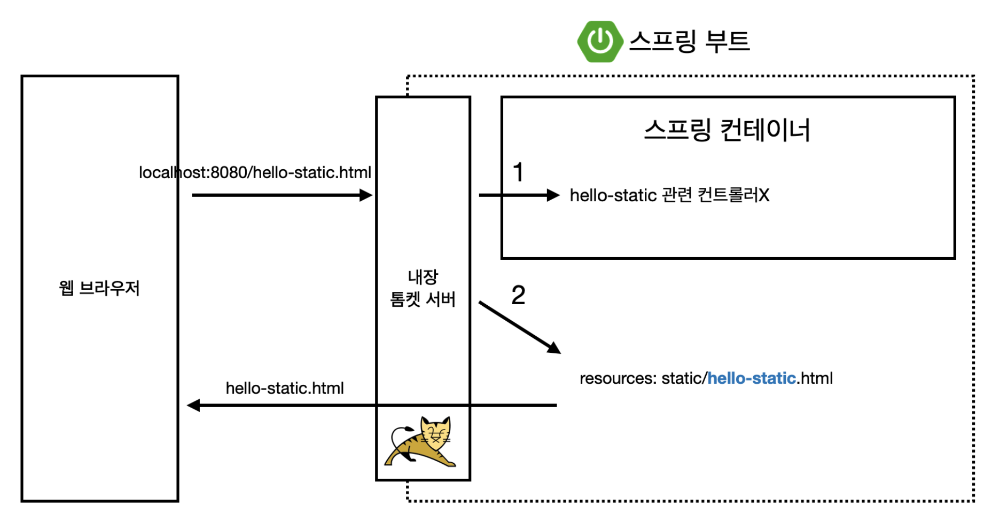
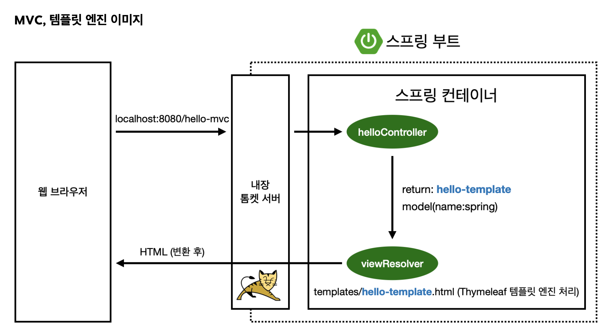
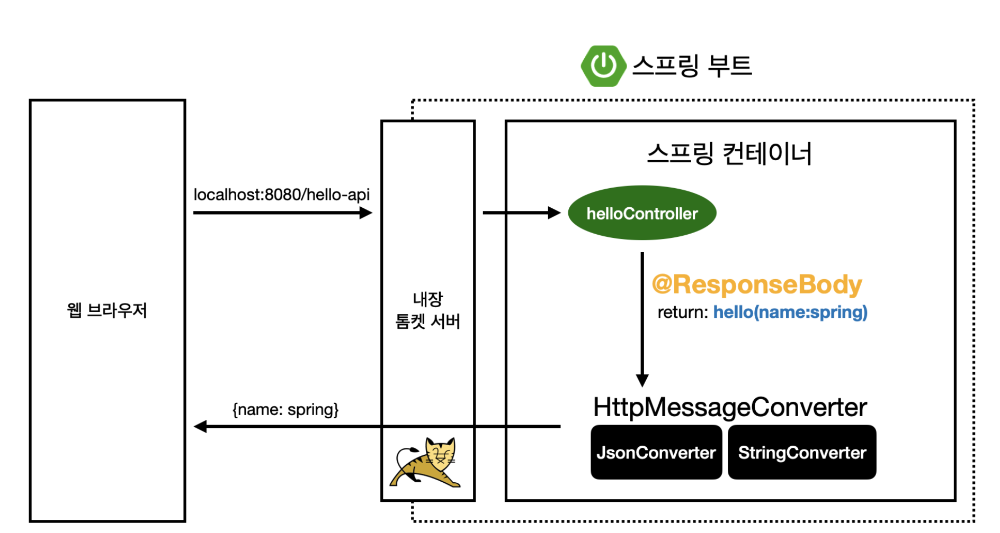
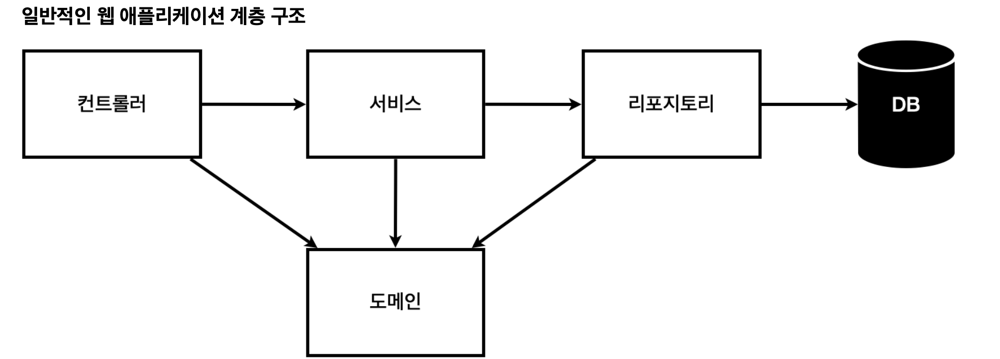

# SPRING INTRODUCTION

 ## Start Spring
   - spring.io : 스프링 부트 기반으로 프로젝트 만들어주는 사이트
   - maven/gradle : 필요한 라이브러리를 땡겨오고, 빌드하는 라이프사이클까지 다 관리해주는 툴
     - 의존관계를 관리
   - dependencies : 스프링 부트 기반 프로젝트를 어떤 라이브러리를 땡겨서 쓸건지
   - Thymeleaf : html을 만들어주는 탬플릿 엔진
   - Spring Boot : 톰캣과 웹서버 내장

    ### 라이브러리
     - spring-boot-starter-web
       - spring-boot-starter-tomcat: 톰캣 (웹서버)
       - spring-webmvc: 스프링 웹 MVC
       - spring-boot-starter-thymeleaf: 타임리프 템플릿 엔진(View) 
       - spring-boot-starter(공통): 스프링 부트 + 스프링 코어 + 로깅
         - spring-boot : spring-core
         - spring-boot-starter-logging : logback, slf4j
     - spring-boot-starter-test
       - junit: 테스트 프레임워크
       - mockito: 목 라이브러리
       - assertj: 테스트 코드를 좀 더 편하게 작성하게 도와주는 라이브러리
       - spring-test: 스프링 통합 테스트 지원
     - 참고: `spring-boot-devtools` 라이브러리를 추가하면, `html` 파일을 컴파일만 해주면 서버 재시작 없이 View 파일 변경이 가능
    
    ### Welcome Page
    > 도메인만 누르고 들어왔을 때, 첫 화면 
     - 스프링 부트는 resources/static/index.html에 넣어두면 자동으로 welcome page로 인식
     - 정적 페이지
       - 파일을 그냥 웹서버가 웹브라우저에 던저준 것 뿐 (보여주는 것 뿐)
       - 프로그래밍이 아님
    
    ### 템플릿 엔진 thymeleaf
     - https://www.thymeleaf.org/
    
    ### Controller
    > 웹 어플리케이션에서 첫번째 진입점
    
     1. localhost:8080/hello -> 내장 톰캣 서버에서 받음 -> spring에 hello 매핑되어 있는 메서드 찾아서 실행
     2. 해당 메서드에 Spring이 Model을 만들어서 key에 value 넣어줌
     3. return에 기재된 resources/templates 에 해당 파일에 가서 화면 렌더링
       - 즉, 컨트롤러에서 리턴 값으로 문자를 반환하면 뷰 리졸버(`viewResolver`)가 화면을 찾아서 처리
       - resources:templates/` +{ViewName}+ `.html`

    ### 터미널에서 실행
     - 프로젝트 폴더 위치에서
     - build
       - `./gradlew build`
     - cd build/libs
       - `java -jar hello-spring-0.0.1-SNAPSHOT.jar`

 ## 스프링 웹개발 기초
   1. 정적 컨텐츠
   > 서버에서 하는 것 없이 파일을 그대로 웹 브라우저에 내려주는 것
   
     - web 브라우저에서 `~/hello-static.html` -> 톰캣 서버가 요청 받음
     - spring에 넘기면, controller에서 hello-static 관련되어 매핑되어 있는 controller가 있는 지 확인
     - 못찾는 경우, resources/static에 해당 html 찾음
     - 있으면 바로 반환

   2. MVC와 템플릿엔진
   > 서버에서 프로그래밍해서 동적으로 바꿔서 html을 보여주는 것
    - Model
     > 비즈니스 로직
    - View
     > 화면을 그리는 데에만 집중
    - Contorller
     > 비즈니스 로직
    
    
     - web browser -> 내장 톰캣서버 -> 스프링
     - 스프링은 helloController에 매핑된 메서드 찾아서 호출
     - 리턴할 때, hello-template 이름으로 model(name:mini)
     - 스프링이 뷰를 찾아주고 템플릿 엔진을 연결시켜주는 viewResolver 동작
       - templates/hello-template.html을 찾아서 thymeleaf에 처리해달라고 넘김
     - thymleaf가 렌더링을 해서 변환을 한 html을 반환

   3. API
   > json 데이터 구조 포멧으로 클라이언트로 데이터 전달하는 방식
   
    - web browser -> 내장 톰캣 서버 -> 스프링
    - 스프링은 helloContoller에 매핑된 hello-api 찾음
    - @ResponseBody 에 의해 `httpMessageConverter` 동작
       - http응답에 return값 넘겨줘야 함
       - 리턴 형태가 문자열인 경우, `StringConverter`가 문자 처리
       - 리턴 형태가 객체인 경우, 기본 defalut가 json방식으로 데이터를 만들어서 http응답에 반환 (`MappingJackson2HttpMessageConverter`)
    ✍️ 객체를 json으로 바꿔주는 라이브러리
       - jackson (spring 기본 탑재)
       - gson
  
   ## 웹 애플리케이션 
     ### 
     
     - 컨트롤러: 웹 MVC의 컨트롤러 역할
     - 서비스: 핵심 비즈니스 로직 구현
     - 리포지토리: 데이터베이스에 접근, 도메인 객체를 DB에 저장하고 관리
     - 도메인: 비즈니스 도메인 객체
        예) 회원, 주문, 쿠폰 등등 주로 데이터베이스에 저장하고 관리됨

    ### 테스트 케이스
     - JUnit이라는 프레임워크로 반복 실행하기 어렵고 여러 테스트를 한번 에 실행하기 어렵다는 단점을 극복
  
   ## 스프링 빈과 의존관계
     ### 스프링 빈 등록 방법
     1. 컴포넌트 스캔과 자동 의존관계 설정
       ex. @Controller, @Service, @Repository ,,,
       - 해당 어노테이션에 @Component가 포함되어 있음
     2. 자바 코드로 직접 스프링 빈 등록하기

    ✍️ 참고: 스프링은 스프링 컨테이너에 스프링 빈을 등록할 때, 기본으로 싱글톤으로 등록한다(유일하게 하나만 등록 해서 공유한다)
      따라서, 같은 스프링빈이면 같은 인스턴스이다.

     ### DI 방법
       1. 필드 주입
       2. setter 주입
       3. 생성자 주입 (권장)
         : 생성자를 통해서 주입이 됨
    
    ✍️ `@Autowired` 를 통한 DI는 스프링이 관리하는 객체 에서만 동작한다. 
      스프링 빈으로 등록하지 않고 내가 직접 생성한 객체에서는 동작하지 않는다.

   ## 스프링 DB접근 기술
     1. 순수 JDBC
     > JAVA는 기본적으로 db랑 붙기위해 JDBC 드라이버가 꼭 있어야함 (연동역할)
       + db랑 붙을때, 데이터베이스가 제공하는 client가 필요함 (예제로는 h2)

       - 개방-폐쇄 원칙(OCP, Open-Closed Principle)
         : 확장에는 열려있고, 수정, 변경에는 닫혀있다.
       - 스프링의 DI (Dependencies Injection)을 사용하면 `기존 코드를 전혀 손대지 않고, 설정만으로 구현 클래스를 변경`할 수 있다.
         (객체지향의 큰 장점)

     2. JdbcTemplate

     3. JPA
     > 객체를 바로 db에 쿼리없이 저장 

