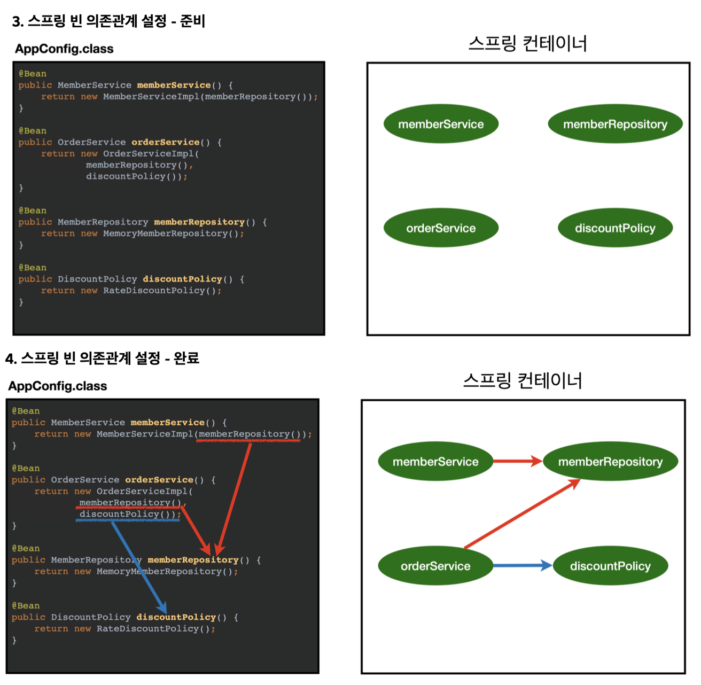

# 스프링 프레임워크
> 핵심 `객체 지향` 애플리케이션을 만들수 있도록 지원
 ```text
   - 핵심 기술: 스프링 DI 컨테이너, AOP, 이벤트, 기타
   - 웹 기술: 스프링 MVC, 스프링 WebFlux
   - 데이터 접근 기술: 트랜잭션, JDBC, ORM 지원, XML 지원
   - 기술 통합: 캐시, 이메일, 원격접근, 스케줄링
   - 테스트: 스프링 기반 테스트 지원
   - 언어: 코틀린, 그루비핵심기술 : 스프링 
 ```
 - 객체지향의 핵심 : 다형성
 - 클라이언트를 변경하지 않고, 서버의 구현 기능을 유연하게 변경할 수 있다.
 - 제어의 역전(IoC), 의존관계 주입(DI)로 스프링이 객체지향설계를 지원

 ## SOLID (좋은 객체 지향 설계의 5가지 원칙)
   1. SRP 단일책임원칙 (single responsibility principle)
     - 한 클래스는 하나의 책임만 가져야 한다. 
     - 문맥과 상황에 따라 다르다.
     - 중요한 기준은 `변경`. 변경이 있을 때 파급 효과가 적으면 단일 책임 원칙을 잘 따른 것 
       예) UI 변경, 객체의 생성과 사용을 분리
   2. OCP 개방-폐쇄 원칙 (Open/closed principle)
     - 소프트웨어 요소는 확장에는 열려 있으나 변경에는 닫혀 있어야 한다. (다형성 활용)
     - 인터페이스를 구현한 새로운 클래스를 하나 만들어서 새로운 기능을 구현
   3. LSP 리스코프 치환 원칙 (Liskov substitution principle)
     - 프로그램의 객체는 프로그램의 정확성을 깨뜨리지 않으면서 하위 타입의 인스턴스로 바꿀 수 있어야 한다
     - 다형성에서 하위 클래스는 인터페이스 규약을 다 지켜야 한다는 것, 다형성을 지원하기 위 한 원칙, 인터페이스를 구현한 구현체는 믿고 사용하려면, 이 원칙이 필요하다.
       예) 자동차 인터페이스의 엑셀은 앞으로 가라는 기능, 뒤로 가게 구현하면 LSP 위반, 느리 더라도 앞으로 가야함
   4. ISP 인터페이스 분리 원칙 (Interface segregation principle)
     - 특정 클라이언트를 위한 인터페이스 여러 개가 범용 인터페이스 하나보다 낫다 
       예) 자동차 인터페이스 -> 운전 인터페이스, 정비 인터페이스로 분리 사용자 클라이언트 -> 운전자 클라이언트, 정비사 클라이언트로 분리
     - 다른 클라이언트에 영향을 주지 않음 인터페이스가 명확해지고, 대체 가능성이 높아진다.
   5. DIP 의존관계 역전 원칙 (Dependency inversion principle)
     - 프로그래머는 “추상화에 의존해야지, 구체화에 의존하면 안된다.” 의존성 주입은 이 원칙 을 따르는 방법 중 하나다.
       즉, 클라이언트가 interface만 바라봐야지, 구현체를 바라보고 알면 안됨

 ## 스프링 부트
 > 스프링을 편리하게 사용할 수 있도록 지원
   - Tomcat같은 웹 서버를 내장해서 별도의 웹 서버를 설치하지 않아도 됨
   - starter 종속성으로 쉬운 빌드 구성
   - 스프링과 3th parth(외부) 라이브러리 자동 구성

 ## AppConfig
 > 애플리케이션 전체를 설정하고 구성한다.
 
   - 애플리케이션의 실제 동작에 필요한 구현 객체를 생성
   - 객체의 생성과 연결 담당
   - So, 관심사 분리 완료 (객체를 생성하는 역할 : config / 실행하는 역할 : impl)
   
    ### DI (Dependency Injection)
     > 의존성 주입 (의존성 관계) : 애플리케이션 `실행 시점(런타임)`에 외부에서 실제 구현 객체를 생성하고 클라이언트에 전달해서 클라이언트와 서버의 실제 의존관계가 연결 되는 것
     - 클라이언트인 ServiceImpl 입장에서, 의존관계를 마치 외부에서 주입해주는 것과 같음
     - 의존관계
       1. 정적인 클래스 의존 관계
         - 클래스가 사용하는 import 코드만 보고 의존관계를 쉽게 판단 
         - 애플리케이션을 실행하지 않아도 소스코드만 보고도 알 수 있음
       2. 동적인 객체(인스턴스) 의존 관계
         - 실행 시점에 결정됨
     - 클라이언트 코드를 변경하지 않고, 클라이언트가 호출하는 대상의 타입 인스턴스를 변경 가능
     - 정적인 클래스 의존관계를 변경하지 않고(== 애플리케이션 코드를 손대지 않고), 동적인 객체 인스턴스 의존관계를 쉽게 변경

    ### IoC (Inversion of Contol)
    > 제어의 역전 : 프로그램의 제어 흐름을 직접 제어하는 것이 아니라 외부에서 관리하는 것
     - 프레임워크가 Service나 코드를 자동으로 호출하는 흐름
     - AppConfig가 등장한 이후에 구현 객체는 자신의 로직을 실행하는 역할만 담당. 
     - 프로그램의 제어 흐름은 이제 AppConfig가 담당
 
    ✍️ 프레임워크 vs 라이브러리
      - 프레임워크는 작성한 코드를 제어하고, 대신 실행 (JUnit)
      - 반면에 작성한 코드가 직접 제어의 흐름을 담당하면 라이브러리다.

    ### IoC 컨테이너, DI 컨테이너
    > IoC를 해주는 컨테이너, DI를 해주는 컨테이너
     - AppConfig 처럼 객체를 생성하고 관리하면서 의존관계를 연결해 주는 것
     - 어샘블러, 오브젝트 팩토리 라고도 부름

 ## Spring Container
  > `ApplicationContext` : 스프링 컨테이너 (인터페이스)
   - 스프링 컨테이너는 `@Configuration` 이 붙은 `AppConfig` 를 설정(구성) 정보로 사용
   - `@Bean` 이 라 적힌 메서드를 모두 호출해서 반환된 객체를 스프링 컨테이너에 등록 : `스프링빈`
  
  
  
  ```text
   1. new AnnotationConfigApplicationContext(AppConfig.class) 으로 AppConfig의 정보를 준다.
   2. 스프링 컨테이너가 만들어짐
   3. 스프링 컨테이너 안, 스프링 빈 저장소(key: 빈 이름, value: 빈 객체) 에 파라미터로 넘어온 해당 구성정보를 사용해서 스프링빈 등록
     (빈 이름은 항상 다른 이름을 부여)
   4. 스프링 컨테이너는 설정 정보를 참고해서 의존관계를 주입(DI)
  ```

 ## 스프링 빈
   - 빈 등록시, 동일한 타입이 둘 이상이면 오류 발생 => 빈 이름 등록해주면 됨
    ### 상속관계
     - 부모타입으로 조회하면 자식 타입도 같이 조회됨
     - 그래서 모든 자바 객체의 최고 부모인 `Object` 타입으로 조회하면, 모든 스프링 빈을 조회
     - java 는 기본적으로 최상위 부모는 Object 임

    ### Bean Factory
     - 스프링 컨테이너의 최상위 인터페이스
     - 스프링 빈을 관리하고 조회하는 역할을 담당 (getBena() 등 제공)
     

    ### ApplicationContext
     - BeanFactory 기능을 모두 상속받아서 제공
     - 애플리케이션을 개발할 때는 빈을 관리하고 조회하는 기능은 물론이고, 수 많은 부가기능이 필요
     - BeanFactory나 ApplicationContext를 스프링 컨테이너라 한다.
     - BeanFactory를 직접 사용할 일은 거의 없고, 부가기능이 포함된 ApplicationContext를 사용
     - ApplicationContext가 제공하는 부가 기능
       - 메시지소스를 활용한 국제화 기능 : 예를 들어서 한국에서 들어오면 한국어로, 영어권에서 들어오면 영어로 출력
       - 환경변수 : 로컬, 개발, 운영등을 구분해서 처리
       - 애플리케이션 이벤트 : 이벤트를 발행하고 구독하는 모델을 편리하게 지원
       - 편리한 리소스 조회 : 파일, 클래스패스, 외부 등에서 리소스를 편리하게 조회
     

    