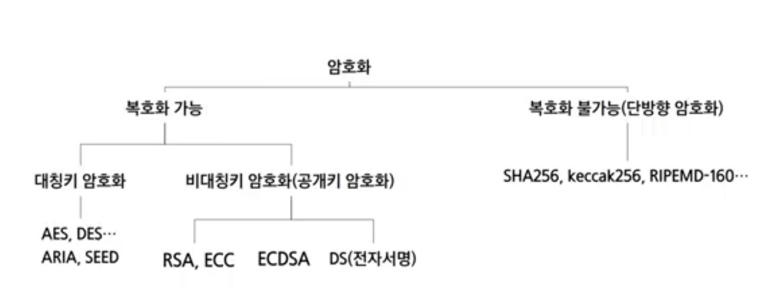
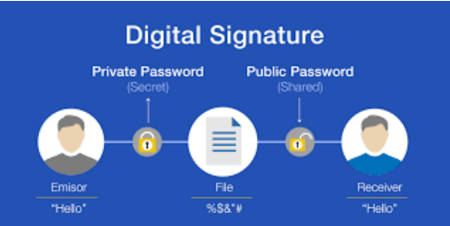
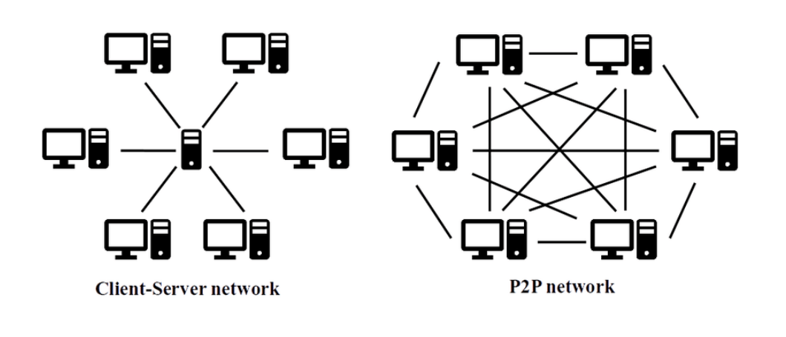
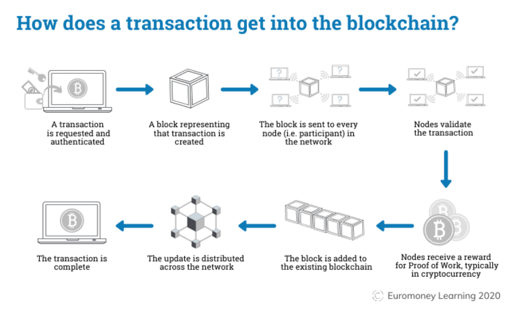
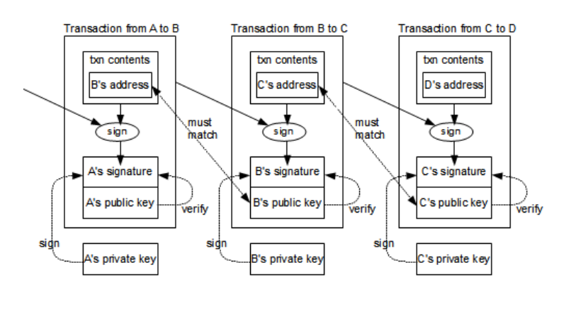
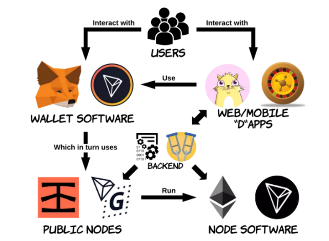
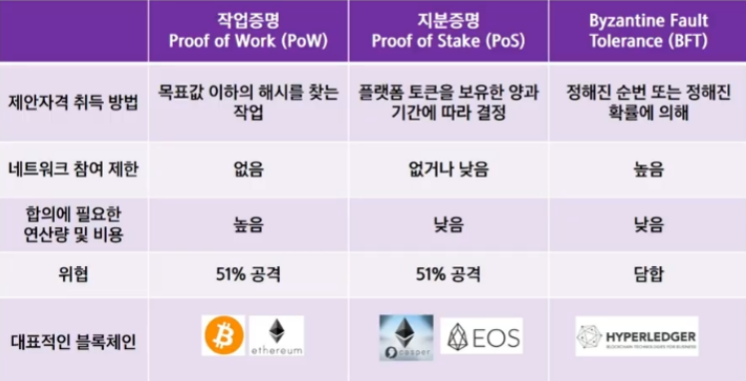
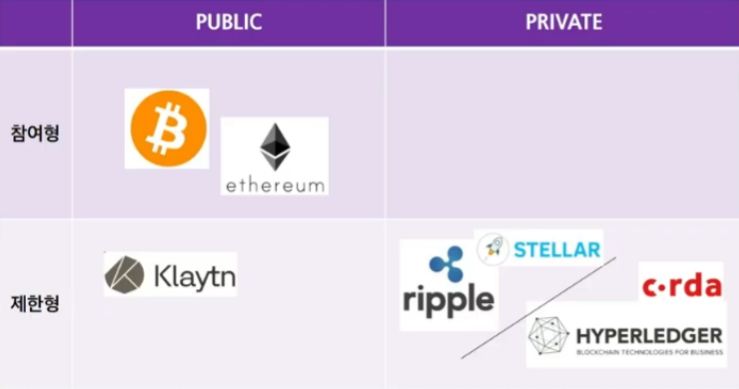
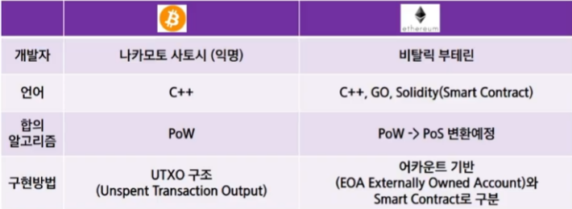

# 01. Blockchian

## INDEX 

1. Blockchian이 뭔지를 알 수 있다. 
2. 암호 알고리즘에 대해 알수있다. 
3. Lockchian 활용 어플리케이션을 알 수 있다.

### BlockChain?

- Block : 저장하는 데이터의 단위, 위변조가 되면 안되는 것을 투명하게 저장할 수 있다. 
- Chain : N번째가 있으면 N-1째와 연결되어있는 것을 보장할 때

### 암호화

Q. SHA256에서 256이 의미하는 바는? 

A. 256비트까지 표현할 수 있음을 의미한다. 복호화 불가능한 내용은 해시함수 가 대표적으로 있다.

### 복호화 불가능 - Hash function

- 검증단계에서 사용한다. 

  예) 회원의 비밀번호 

- y = f(x)의 형태에서 x로 y를 알수는 있지만 y로 f(x)를 확인할 수는 없다. 이 내용이 복호 화가 불가능하다는 내용과 일맥상통하다.

### 복호화 가능

> 대칭키

- 암호화 하는 키과 복호화하는 키가 같은 알고리즘을 말한다. 

  예) AES, ARIA, SEED

  [KISA 암호이용활성화](https://seed.kisa.or.kr/kisa/index.do)

- Key가 노출되면 모든 정보를 볼 수 있는 것이 가장 취약점이다.

  ⇒ Key Store 서버 등으로 별도로 두는 경우가 많다.

### 비대칭키(공개키 암호화)

- 하나는 잠그는 용, 하나는 푸는 용이다. 여기서 잠글때는 공개키, 푸는 용이 개인(공개) 키이다. 이렇게 한쌍으로 사용되는데, 암호화는 누구나 가능하지만 복호화는 누구나 할 수 없다. 

  예) RSA, ECC

Q. AWS 상황에서 pem.key등을 해서 접속을 가능하게 하였는데 어떤 알고리즘일까? 

A. RSA의 방식으로 구현되어있다.

### Digital Signature

- middle attack으로 제 3자가 가로채어서 부적합하게 접속하지 않도록 하는 과정이 중요 하다.
- 장점 
  - middle attack 등의 내용을 방지할 수 있다. 
  - 신뢰성이 높아진다. 
- 단점 
  - 개인키 관리라는 리스크는 여전히 존재한다. 
  - 구현이 어려우며, 긴 프로세스때문에 속도적으로 느리다

### BLOCKCHAIN NETWORK

### How to work

[Blockchain Explained: How does a transaction get into the blockchain? | Euromoney Learning](https://www.euromoney.com/learning/blockchain-explained/how-transactions-get-into-the-blockchain)

### Data in Block

### Applications

1. 결제 : 속도가 많이 소모되기 때문에 현재는 많이 사용되지 않는다. 
2. 데이터 Storage : 암호화폐(송금 내역), 스마트 계약, 물류관리, 지역 화폐, 문서관리, 의 료정보관리, 저작권 관리 등
3.  World Computing

### Fully Decentralized vs Semi-Decentralized

[Dapp back-end architecture, security and design patterns - 51CTO.COM](https://developer.51cto.com/art/202103/647942.htm)

### 요약&정리

1. 블록체인은 보안성, 투명성, 무결성, `탈중앙화` 의 특징을 가지고 있고, 이 특징으로 여러가 지 어플리 케이션을 활용할 수 있다. 
2. 블로체인의 네트워크는 기본적으로 `P2P` 네트워크에서 작동한다. 
3. 암호화에는 복호화 가능 암호화, 단방향 암호화로 나눠지고, 단방향 암호화는 해시함수 로, 단방향 암호화는 해시함수로, `SHA256` , keccask256 등이 있다. 
4. 암호화에 서명과 확인을 이용해 메시지의 무결성과 송신자를 보증하는 알고리즘을 `전자 서명` 이라고 한다. 
5. `ECC(Elliptic curve cryptography)` 암호화 알고리즘은 공개키 암호화로 타원 곡선 함수 를 이용하여 암호화 한다.

# 02. 금융시스템vs블록체인

## INDEX

- 블록체인의 활용
- 금융 비즈니스의 프로세스를 알 수 있다.
- BlockChian의 종류를 알 수 있다. 
- BlockChian의 탄생 배경과 철학을 알 수 있다.

### 활용

- 결제 
- 암호화폐(거래 내역), 스마트 계약, 물류관리, 지역화폐, 문서관리, 의료정보관리, 저작 권 관리, 한정판 디지털상품(Non Fungible Tokens), 게임아이템관리, 소셜미디어관리, 전자투표, 신원확인 
- World Computing

### 금융에서 '은행'이 왜 필요할까?

- 신뢰 : 돈이 오가는 단계에서의 믿음을 구축하기 위한 내용이다. 

- 이중 지불 문제 : 이 내용을 해결하기 위한 역할도 있다. 

  ⇒ 이 부분이 블록체인의 특징이다. 이 부분에 대한 신뢰도 높게 증명하기 위해 합의 알 고리즘을 사용한다.

### Consensus Algorithm

### Type of BlockChian

### Cryptocurrency

