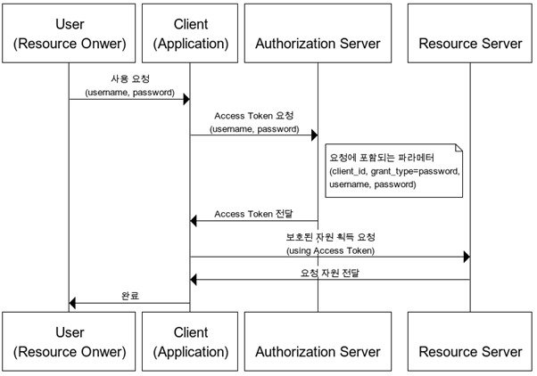

# OAuth2.0

## 정의
 > 사용자가 비밀번호를 제공 않고 타 웹사이트나 어플에 접근 권한(`Access Token`)을 부여해 해당 정보를 사용하도록 하는 프로토콜
   즉, 타 사이트 사용자 정보에 대한 엑세스 권한 부여
   [!프로토콜이란?](./%ED%94%84%EB%A1%9C%ED%86%A0%EC%BD%9C.md)

✍️ OAuth1.0과의 차이
 - 기능의 단순화, 기능과 규모의 확장성 등을 지원
 - https를 통해 암호화를 하여 과정의 단수화
 - 다양한 인증 방식
 - api서버에서 인증서버와 리소스 서버가 분리

## 구성
 - Resource Owner : 사용자
 - Client : Resource Server에서 제공하는 자원을 사용하는 애플리케이션
 - Resource Server (API Server) : 자원을 호스팅하는 서버
    - 호스팅 : 서버 컴퓨터의 전체 또는 일정 공간을 이용할 수 있도록 임대해 주는 서비스
 - Authorization Server : 사용자의 동의를 받아서 권한을 부여하는 서버

## 종류
  ### 권한 부여 코드 승인 방식   
   
    
  ### 암시적 승인 타입
   1. 권한 부여 코드 승인방식에서 AccessToken 발급을 위한 Code 발급과정이 없음
   2. Refresh Token 사용 불가
   3. redirect URL 에 AccssToken 이 response_type 으로 넘겨지기 때문에 토큰 노출 위험
    
  ### 자원 소유자 자격증명 승인 방식
   1. userId, userPsw를 바로 던져 AccessToken 발급
   2. 보안 위험
   3. Refresh Token 사용 가능
    
   
    
  ### 클라이언트 자격증명 승인 방식
   1. 클라이언트 자신이 관리하는 리소스 혹은 권한 서버에 해당 클라이언트를 위한 제한된 리소스 접근 권한이 설정되어 있는 경우 사용
   2. 자격증명을 안전하게 보관할 수 있는 클라이언트에서만 사용되어야 함
    
   
    
## OAuth Flow
  https://tecoble.techcourse.co.kr/post/2021-07-10-understanding-oauth/
  [!Oauth2.0_process](./README_images/oauth2.0-process.png)
  => 셍활코딩 OAuth 

## Kakao 로그인 구현
  > 권한부여승인 인증종류 사용
  - ID와 비밀번호로 사용자 신원을 확인
  - 로그인 세션 대신 사용 가능한 ID 토큰 제공 
  - 액세스 토큰(Access token), 리프레시 토큰(Refresh token) 두 종류의 토큰을 발급

  ### 토큰
   - Access token
    : 사용자 인증, API 호출 권한 부여
    (Android, iOS : 12시간, JavaScript: 2 시간, REST API : 6시간)
    => 카카오계정 세션
      클라이언트에서 사용자가 이미 카카오계정으로 로그인한 상태라면 카카오계정 세션이 존재
      로그인 시 카카오계정 세션의 인증 시간은 기본 `24시간`
      사용자가 카카오계정 로그인 화면에서 [로그인 상태 유지]를 선택한 경우에는 인증 시간이 `1달`입니다.
   - Refresh token
    : 액세스 토큰 재발급에 사용
     유효한 리프레시 토큰이 있다면 사용자가 매번 카카오계정 정보를 입력하거나 로그인하는 인증 절차를 거치지 않아도 액세스 토큰 재발급 가능
     (how????)
     (2달, 만료 시간 1달 남은 시점부터 갱신 가능)
   - ID token
    : 로그인 사용자의 인증 정보를 제공하는 토큰
     (만료시간은 액세스 토큰과 동일)
    => Kakao SDK는 토큰 관리 기능 내장, REST API 사용 시 필요에 따라 토큰 정보 확인하기 또는 토큰 갱신하기 요청 필요

  ### OpenID Connect 지원
   - 사용자 인증 정보를 담은 ID 토큰을 함께 발급

## 참고링크
 1. OAuth 이용해 인증 구현
  - https://velog.io/@devjade/OAuth-authentication-%EA%B5%AC%ED%98%84%ED%95%98%EA%B8%B0github-%EB%A1%9C%EA%B7%B8%EC%9D%B8

 2. OAuth 모듈 구현
  - https://cozy-ho.github.io/server/2021/07/19/Nodejs%EB%A1%9C-OAuth-%EC%9D%B8%EC%A6%9D%EC%84%9C%EB%B2%84-%EB%A7%8C%EB%93%A4%EA%B8%B0-oidc-provider.html
  - java로 구현 !!!! : https://co-de.tistory.com/29
