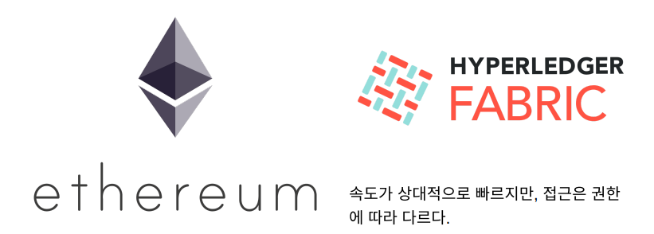
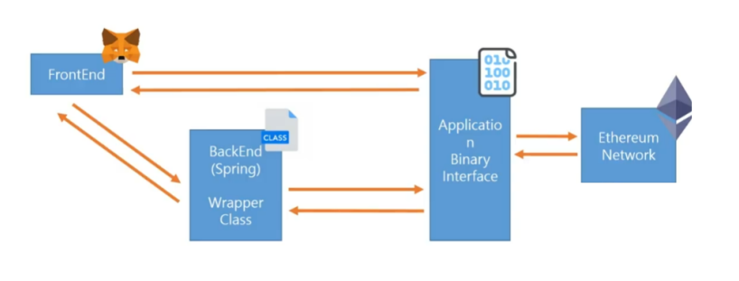

# 블록체인 프로젝트의 설계와 구조

## 어떤 체인?



- Pulib Chain은 누구나 접근이 가능하고 진정한 의미의 탈중앙화라는 장점이 있음 
- 한편으로는 데이터를 저장하는 것이 매우 비싸고 Transaction이 발생할 때마다 비용을 지불해야한다. 
- 다소 복잡한 Smart Contract의 배포 비용 
- Private Chain은 DB에 준하는 빠른 속도
- 사전에 약속된 사용자만 참가 가능 
- 주로 Hyperledger facbric을 사용한다. 
- 사용자가 인지할 수 없는 사이에 블록체인 활용 가능


## 전체 구조



### 01. 메타마스크(FE)

- 쉽게 사용할 수 있는 크롬 익스텐션 
- Key를 보관하고 서명을 안전하게 하는 역할을 한다. 
- Web3를 이용해서 쉽게 서명할 수 있다. 
- 개발자는 추상화 된 API를 이용해서 쉽게 개발 가능
-  Web3.js를 이용
- 직접 private key를 이용해서 서명하는 것도 가능하지만 metamask와 같은 서비스를 이용하는 것이 안전하다. 
- 다른 사람의 지갑 주소로 ETH를 전송하거나 Smart Contract과 통신해서 데이터를 받 아오는 것도 가능


### 02. ABI(Application Binary Interface)

- Binary 형태로 컴파일 된 Smart Contract과 통신하기 위한 Interface
- build는 solc를 사용해서 진행한다. 
- deploy는 bytecode와 abi를 이용해서 deploy 한다.

```javascript
const MyContract = new web3..eth.Contract(abi);

let deploy = MyContract.deploy({
            data: bytecode,
            from: send_account
        }).encodeABI();
```


### 03. Payble Modifier

- 이더리움의 핵심 로직은 이더리움을 이용한 결제를 통해 발생한다. 
- Smart Contract에 입급될 때 로직을 구성하고 심다면 payable modifier를 붙여준다면 구현이 가능하다. 
- 예시 : 모임 통장 만들기, 경매, 안전 거래 등등 
- 대부분의 핵심 로직은 payable modifer를 이용해서 구현한다.


### 04. 블록체인에 영상을 저장할 때

- 이더리움 블록 크기는 1~8MB 수준 

- 텍스트 형태의 데이터라도 200개 이상 저장하는 것이 어렵다. 

- 영상의 경우는 일반적으로 파일의 정합성을 확인할 때는 해시값이 이용한다. 

  ⇒ 동영상의 해시값을 블록체인에 저장할 수 있다.


### 05. 이더리움 vs 자체 코인

> 화폐의 가치는 어떻게 결정되는가?

- 화폐의 가치는 그 화폐를 사람들이 얼마나 신용하는지에 따라서 결정된다. 
- 코인의 가치 혹은 블록체인의 가치도 사람들의 신용도에 따라서 결정된다. 
- 이더리움은 많은 사람들이 사용하기 때문에 신용도가 높고 가치도 높다. 따라서 자체 코 인은 자유도는 높지만 신용도가 낮을 것이다.


### 06. Wrapper Class

- Web3j를 이용해서 Smart Contract와 통신하기 위해서는 Wrapper Class를 생성해야 한다. 
- Compile된 Binary로부터 Wrapper Class를 생성한다. 
  - 즉, 조금이라도 변경되면 Wrapper Class를 다시 만들어야 한다. 
  - 여기서에 조금은 주석, 공백을 포함해서 모두... 😱

 ⇒ Jenkins 같은 자동화된 빌드 도구를 사용하는 것이 좋은 방법


### 07. Blockchain network

> 유저가 블록체인을 불편해 할 때

- 서비스 제공자가 사용자 별로 키를 보관하고 관리해줄 수 있다. 
- 신규 유저가 생기면 지갑을 생성하고 보관한다. 
- 로그인 인증을 통해 유저를 확인하고 대신 서명을 한다. 
- 일반적인 거래소들이 많이 활용하는 방법이다. 대부분 유저들에게 블록체인이 이해시키 기 어렵기 때문에 사용한다.


### 08. FE? BE? 어디서 처리할까

- 완전한 탈중앙화를 추구한다면 프론트엔드에서 유저에게 서명하는 것이 옳다. 

하지만, 유저입장에서 블록체인에 익숙하지 않기 때문에 우리 서비스의 백엔드에서 대 신 관리해주는 것도 가능하다. 

⇒ 따라서 구조를 설계할 때 반드시 미리 결정해야하는 부분이 이 곳이다.


### 09. 어떤 네트워크를 사용할 것인가?

- private network를 구성하는 것이 가장 기본적으로 적용해볼 수 있다. 

- Infura와 같은 Public하게 구성된 테스트넷들이 많이 있다. 

  → 실제로 이더리움 메인넷과 동일한 환경인 테스트넷을 사용하는 것이 가능하다. 

  ⇒ 실 서비스를 운영한다면 이더리움 메인넷에 배포해야 할 


