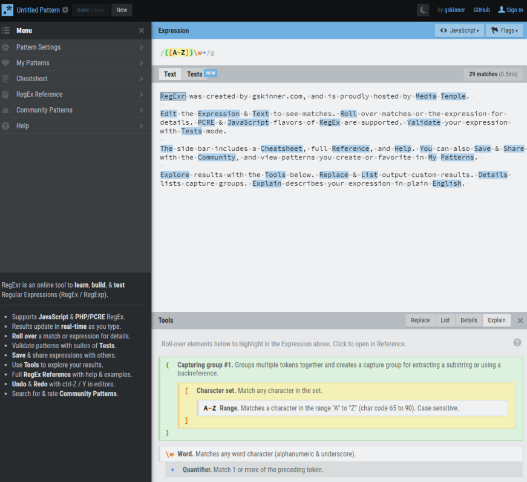

# 정규표현식

## **표현식 (Expressions)?**

- 프로그래밍 언어에서 변수와 상수, 그리고 연산자로 이루어진 식
- 3 + 7, score * 10

## **정규표현식 (Regular expressions)**

```
문자열을 취급하는 강력한 도구
```


- 완전한 프로그래밍 언어가 아님
- 다른 프로그래밍 언어나 제품에 포함된 `작은 언어` 관점
- 제품마다 상이한 문법
- 텍스트를 찾고 조작하는 데 쓰는 문자열
- 텍스트 검색, 치환에 사용
- 수십 라인의 프로그래밍 없이 정규식 1~2줄로 대부분의 문자열 작업 가능

## **정규표현식의 사용**

- email, 주민번호, 생년월일 등의 형식 검증 (validation)
- 데이터 전처리 작업
- 프로젝트 리팩토링 작업
- Database 검색, 치환 작업
- IDE, editor, 심지어 MS word도 지원

## **Regex online test**

https://regexr.com/




### **문자 하나 찾기**

- 일반적인 문자 그대로 기재
- `.`와 같은 메타문자를 검색하려면 `\`로 이스케이프

### **문자 집합으로 찾기**

- 대괄호를 `[]` 사용하여 문자 집합 표현
- `[]` 집합에 속한 문자 가운데 하나가 일치
- `[]` 내에 ``은 연속 요소를 표현 `[1-5]` => `[12345]`
- 캐럿 `^` 문자는 집합 안에 있는 문자나 범위를 모두 제외

### **메타 문자 사용**


### **반복 찾기**

- 파워풀한 정규 표현 패턴의 능력
- `+`: 하나 이상 일치
- ``: 없거나 하나 이상 일치
- `?`: 없거나 하나 일치
- 중괄호 `{}` 내에 반복 횟수 기재 `{3}`: 3번
- 게으른 수량자로 문자를 최소로 일치

### **위치 찾기**

- 텍스트 영역 내 특정 위치에서 검색 희망
- `\b`: 단어 경계
- `^`: 문자열 경계의 시작
- `$`: 문자열 경계의 끝

### **하위 표현식 ⭐️**

- 큰 표현식 안에 속한 일부 표현식을 한 항목으로 다루도록 묶음
- `( )`: 괄호로 묶음 가능
- `$gt;{2,}` vs `(>){2,}`
- 파워풀한 중첩된 하위 표현식

### **하위 표현식 - 역참조**

- 하위 표현식으로 매칭된 타겟을 참조
- 일치한 부분을 반복해 찾거나 치환에 사용
- 텍스트를 검색하고 치환하는데 매우 유용
- `There is a ball on on the table` - 실수로 중복된 전치사?`/(\w+)\s\1/g`

### **정규 표현식 예제**

- 이메일`/^\w+([.-]?\w+)*@\w+([.-]?\w+)*(\.\w{2,3})+$/g`
- 차량번호`/\d{2,3}[가-힣]{1}\d{4}/g`