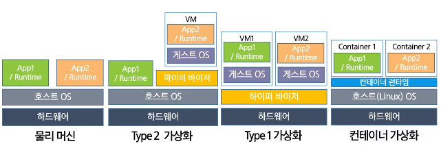
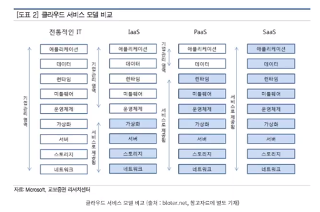

# 클라우드

## 클라우드란?

> 인터넷

- 네트워크의 일종
- 누구나 이용가능한 인터넷도 있고 폐쇄적으로 접근 가능한 인터넷도 있다.
- 인터넷을 통해 클라우드 서비스를 이용

> 클라우드 정의

- `IDC` : internet data center
- `CDC` : cloude data center
- 일반적으로 인터넷으로 인식하게 되며, 이 인터넷을 통해 다양한 서비스를 이용할 수 있도록
- 전세계 데이터 센터에 있는 수백만대 컴퓨터가 긴밀하게 연결해 만들어낸 가상공간
- 클라우드 000 서비스

  - 컴퓨팅

    - 인터넷을 통해 온디맨드로 컴퓨팅 서비스를 제공하고 사용한 만큼만 비용 지불

    - 비용, 속도, 성능, 확장성, 생산성, 안전성

  - 데이터베이스

  - IOT

  - 스토리지

> 클라우드 가상화 기술

- 가상화 기술

  - 물리적 특성을 숨기고 사용자에게 추상화된 가상 자원을 제공하는 기술
  - 서버 가상화, 스토리지 가상화, 네트워킹 가상화, 컨테이너 가상화
  - 이전에는 물리적인 서버를 활용하여 진행
  - Type2
    - 장점 : VM만 있어도 다양한 App을 사용할 수 있다.
    - 단점 : Layer을 넘어가는 소요가 많아 오버헤드가 될 수 있다.
  
  

> 사용 사례

- 개인

  - 클라우스 스토리지 서비스를 이용해 다양한 서비스를 이용

    ⇒ Dropbox, Google Drive, iCloud, 각종 음악/게임 스트리밍, OTT

- 사용자

  - 물리적인 내용을 진행했을 때, 시간적/금액적인 소모가 심각

    ⇒ 클라우드로 옮기면 사용자 트래픽을 자연스럽게 관리해주기에 서비스 배포에 용이하다.

> 클라우드 서비스 모델 비교

- laaS
  - AWS
  - Microsoft Azure
- Paas
  - Heroku
- SssS
  - Cisco WebEx
  - Dropbox
  - Google Apps

[클라우드 강의 AWS1]: https://opentutorials.org/module/3814
[AWS 강좌]: https://www.youtube.com/playlist?list=PLfth0bK2MgIa6w63IglYQD_qljDntSh-H

