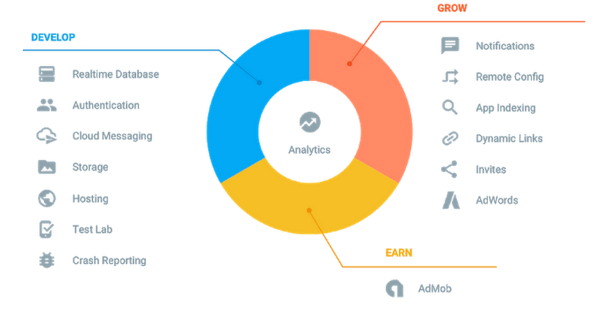

# Firebase_Intro

## 01. Firebase 구조

### 정의

> 앱을 빌드, 개선, 성장시키는 데 도움이되는 Google의 모바일 애플리케이션 개발 플랫폼\


### 구조

1. Develop (개발) 
   - Database 
   - Authentication 
   - Storage 
   - Function 


2. Grow (성장) 

   

3. Earn (수익)




### Firebase 인증

> 종류

- 계정 연동 : 구글, 페이스북, 트위터, 깃허브 등 (네이버, 인스타 등은 제공 X) 
  - 장점 : 대개 클릭 한 번으로 편리하게 인증 
  - 단점 : 구글, 페이스북 계정이 없는 사용자나, 있다고 하더라도 비밀번호를 까먹은 사용자들은 불편 
- 이메일 인증 : 사용자의 이메일 주소에 메일을 보내 URL로 인증 
- 비밀번호 : 이메일, 비밀번호로 인증 
- 익명 인증 : 특별한 가입 절차없이 익명의 계정 생성 장점 : 가입 절차가 없어 접근성이 높음 단점 : 앱 삭제시 사용자가 계정을 잃어버리게 되고, 따라서 유령 계정이 늘어날 수 있음 
- 기타 : 전화번호 인증, Play Game 로그인 등 


### CODE

> JavaScript

- Google 제공업체 개체의 인스턴스를 생성하는 코드

  ```javascript
  var provider = new firebase.auth.GoogleAuthProvider();
  ```

- 팝업 창을 통한 로그인

  ```javascript
  firebase.auth().signInWithPopup(provider).then(function(result) {
  	// This gives you a Google Access Token. You can use it to access the Google API.
  var token = result.credential.accessToken;
  	// The signed-in user info.
  var user = result.user;
  	// ...
  }).catch(function(error) {
  	// Handle Errors here.
      var errorCode = error.code;
      var errorMessage = error.message;
  	// The email of the user's account used.
  	var email = error.email;
  	// The firebase.auth.AuthCredential type that was used.
  	var credential = error.credential;
  	// ...
  });
  ```
  
- 로그인 페이지로 리디렉션한 로그인

  ```javascript
  firebase.auth().signInWithRedirect(provider);
  firebase.auth().getRedirectResult().then(function(result) {
      if (result.credential) {
      // This gives you a Google Access Token. You can use it to access the GoogleAPI.
      var token = result.credential.accessToken;
      // ...
  	}
  	// The signed-in user info.
  	var user = result.user;
  }).catch(function(error) {
      // Handle Errors here.
      var errorCode = error.code;
      var errorMessage = error.message;
      // The email of the user's account used.
      var email = error.email;
      // The firebase.auth.AuthCredential type that was used.
      var credential = error.credential;
      // ...
  });
  ```
  
- 로그아웃

  ```javascript
  firebase.auth().signOut().then(function() {
  	// Sign-out successful.
  }).catch(function(error) {
  	// An error happened.
  });
  ```


> Unity

- Unity 프로젝트를 등록하고 Firebase를 사용하도록 구성 

- Firebase Unity SDK(특히 `FirebaseAuth.unitypackage` )를 Unity 프로젝트에 추가 

- `Firebase.Auth.FirebaseAuth` 클래스 액세스

  ```javascript
  Firebase.Auth.FirebaseAuth auth = Firebase.Auth.FirebaseAuth.DefaultInstance;
  ```

- Firebase 인증

  ```javascript
  Firebase.Auth.Credential credential =
  	Firebase.Auth.GoogleAuthProvider.GetCredential(googleIdToken,
  googleAccessToken);
  auth.SignInWithCredentialAsync(credential).ContinueWith(task => {
  	if (task.IsCanceled) {
          Debug.LogError("SignInWithCredentialAsync was canceled.");
          return;
  	}
  	if (task.IsFaulted) {
  		Debug.LogError("SignInWithCredentialAsync encountered an error: " +
  task.Exception);
  		return;
  	}
      Firebase.Auth.FirebaseUser newUser = task.Result;
      Debug.LogFormat("User signed in successfully: {0} ({1})",
      	newUser.DisplayName, newUser.UserId);
  });
  ```

- 신규 사용자 가입 

  사용자가 양식을 작성하면 사용자가 입력한 이메일 주소와 비밀번호의 유효성을 검사한 후 `CreateUserWithEmailAndPasswordAsync` 메서드에 전달

  ```javascript
  auth.CreateUserWithEmailAndPasswordAsync(email, password).ContinueWith(task => {
  	if (task.IsCanceled) {
  		Debug.LogError("CreateUserWithEmailAndPasswordAsync was canceled.");
  		return;
  	}
      if (task.IsFaulted) {
      	Debug.LogError("CreateUserWithEmailAndPasswordAsync encountered an error: " + task.Exception);
      	return;
      }
      // Firebase user has been created.
      Firebase.Auth.FirebaseUser newUser = task.Result;
      Debug.LogFormat("Firebase user created successfully: {0} ({1})",
      	newUser.DisplayName, newUser.UserId);
  });
  ```
  
- 기존 사용자 로그인 

  기존 사용자가 자신의 이메일 주소와 비밀번호를 사용해 로그인할 수 있는 양식을 만듭니다. 

  사용 자가 양식을 작성하면 `SignInWithEmailAndPasswordAsync` 메서드를 호출

  ```javascript
  auth.SignInWithEmailAndPasswordAsync(email, password).ContinueWith(task => {
      if (task.IsCanceled) {
          Debug.LogError("SignInWithEmailAndPasswordAsync was canceled.");
          return;
      }
      if (task.IsFaulted) {
      	Debug.LogError("SignInWithEmailAndPasswordAsync encountered an error: " + task.Exception);
      	return;
      }
      Firebase.Auth.FirebaseUser newUser = task.Result;
      Debug.LogFormat("User signed in successfully: {0} ({1})",
      	newUser.DisplayName, newUser.UserId);
  });
  ```
  
- 프로필 정보 조회

  ```javascript
  Firebase.Auth.FirebaseUser user = auth.CurrentUser;
  if (user != null) {
      string name = user.DisplayName;
      string email = user.Email;
      System.Uri photo_url = user.PhotoUrl;
      // The user's Id, unique to the Firebase project.
      // Do NOT use this value to authenticate with your backend server, if you
      // have one; use User.TokenAsync() instead.
      string uid = user.UserId;
  }
  ```

- 로그아웃

  ```javascript
  auth.SignOut();
  ```

  

### Firebase DB

> 방식

- **Cloud Fire Store**
- 실시간 데이터베이스


> CODE

1. Java

- 개발환경 설정

  ```java
  // gradle
  compile 'com.google.firebase:firebase-admin:8.1.0'
  ```

- Cloud Firestore 초기화 (Google Cloud Platform에서 초기화)

  ```java
  import com.google.auth.oauth2.GoogleCredentials;
  import com.google.cloud.firestore.Firestore;
  import com.google.firebase.FirebaseApp;
  import com.google.firebase.FirebaseOptions;
  
  // Use the application default credentials
  GoogleCredentials credentials = GoogleCredentials.getApplicationDefault();
  FirebaseOptions options = new FirebaseOptions.Builder()
      .setCredentials(credentials)
      .setProjectId(projectId)
      .build();
  FirebaseApp.initializeApp(options);
  
  Firestore db = FirestoreClient.getFirestore();
  ```

- 데이터 추가

  ```java
  DocumentReference docRef = db.collection("users").document("alovelace");
  // Add document data with id "alovelace" using a hashmap
  Map<String, Object> data = new HashMap<>();
  data.put("first", "Ada");
  data.put("last", "Lovelace");
  data.put("born", 1815);
  //asynchronously write data
  ApiFuture<WriteResult> result = docRef.set(data);
  // ...
  // result.get() blocks on response
  System.out.println("Update time : " + result.get().getUpdateTime());
  ```

- 데이터 읽기

  ```java
  // asynchronously retrieve all users
  ApiFuture<QuerySnapshot> query = db.collection("users").get();
  // ...
  // query.get() blocks on response
  QuerySnapshot querySnapshot = query.get();
  List<QueryDocumentSnapshot> documents = querySnapshot.getDocuments();
  for (QueryDocumentSnapshot document : documents) {
      System.out.println("User: " + document.getId());
      System.out.println("First: " + document.getString("first"));
      if (document.contains("middle")) {
      	System.out.println("Middle: " + document.getString("middle"));
      }
      System.out.println("Last: " + document.getString("last"));
      System.out.println("Born: " + document.getLong("born"));
  }
  ```

  

> JavaScript (Node.js)

- 개발 환경 설정

  ```bash
  npm install firebase-admin --save
  ```

- Google Cloud Platform에서 초기화

  ```javascript
  const admin = require('firebase-admin');
  
  admin.initializeApp({
  	credential: admin.credential.applicationDefault()
  });
  const db = admin.firestore();
  ```

- 데이터 추가

  ```javascript
  const docRef = db.collection('users').doc('alovelace');
  
  await docRef.set({
      first: 'Ada',
      last: 'Lovelace',
      born: 1815
  });
  ```

- 데이터 읽기

  ```javascript
  const snapshot = await db.collection('users').get();
  snapshot.forEach((doc) => {
  	console.log(doc.id, '=>', doc.data());
  });
  ```


## 02. Firebase Cloud Storage

### Firebase Function

> 정의

- Node.js 로 작성 
- Python Django 혹은 Java Spring Boot의 백엔드 없이 실행


> CODE

- firebase-tools 설치

  ```bash
  npm install -g firebase-tools

- 로그인 및 프로젝트 초기화

  ```javascript
  // login
  firebase login
  // init functions
  firebase init functions
  ```

- package 설치

  ```bash
  npm install --save express
  ```

- index.js

  ```javascript
  const functions = require('firebase-functions');
  const express = require('express');
  const app = express(); app.get('/getMessage', (req, res) => {
      if (Math.random() < 0.5) { res.send('World!'); }
      else { res.send('Hello!'); }
  });
  const server = app.listen(process.env.PORT || '3000', () => {
  	console.log('server listening on port %s', server.address().port);
  });
  // /api prefix를 가지는 요청을 express 라우터로 전달
  exports.api = functions.https.onRequest(app);
  ```

- Cloud functions 배포

  ```bash
  firebase deploy --only functions
  ```

  

