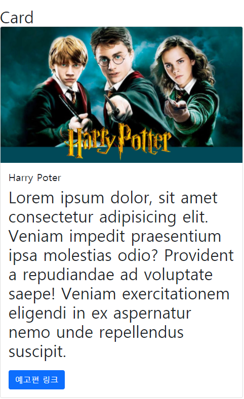
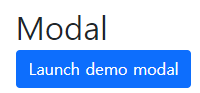

# Web

## 02월 05일

### Bootstrap을 이용해 🤠Harry Potter🤠 웹 페이지 구성

> Card 만들기

```html
<!DOCTYPE html>
<html lang="en">
<head>
  <meta charset="UTF-8">
  <meta name="viewport" content="width=device-width, initial-scale=1.0">
    
  <!-- Bootstrap cdn 주소 -->
  <link href="https://cdn.jsdelivr.net/npm/bootstrap@5.0.0-beta1/dist/css/bootstrap.min.css" rel="stylesheet" integrity="sha384-giJF6kkoqNQ00vy+HMDP7azOuL0xtbfIcaT9wjKHr8RbDVddVHyTfAAsrekwKmP1" crossorigin="anonymous">
    
  <title>Document</title>
</head>
    
<body>
  <div class="container">
      
    <hr>
    <h2>Card
        
      <!-- 넓이 30rem인 카드 사이즈 만들기 -->
      <div class="card" style="width: 30rem;">
          
        
        <div class="card-body">
            
          <!-- title은 Harry Potter로! -->
          <h5 class="card-title">Harry Potter</h5>
            
          <!-- 영화 설명은 Lorem이라는 무작위 글자로 채워버리기 -->
          <p class="card-text">Lorem ipsum dolor, sit amet consectetur adipisicing elit. Veniam impedit praesentium ipsa molestias odio? Provident a repudiandae ad voluptate saepe! Veniam exercitationem eligendi in ex aspernatur nemo unde repellendus suscipit.</p>
           
           <!-- 예고편 링크라는 버튼 만들기 -->
          <a href="#" class="btn btn-primary">예고편 링크</a>
        </div>
      </div>
    </h2>    
```


> Carousle 만들기

```html
    <hr>
    <h2>Carousel
	
    <div id="carouselExampleControls" class="carousel slide" data-bs-ride="carousel">
      <div class="carousel-inner">
          
        <!-- 이미지 세개 삽입 -->
        <!-- 해리포터 -->
        <div class="carousel-item active">       
          
        </div>
        
        <!-- 헤르미온느 -->
        <div class="carousel-item">
          
        </div>
          
        <!-- 론 -->
        <div class="carousel-item">
          
        </div>
      
      <!-- 이전 이미지로 넘어갈 수 있는 버튼 -->
      </div>
      <a class="carousel-control-prev" href="#carouselExampleControls" role="button" data-bs-slide="prev">
        <span class="carousel-control-prev-icon" aria-hidden="true"></span>
        <span class="visually-hidden">Previous</span>
      </a>
        
      <!-- 다음 이미지로 넘어갈 수 있는 버튼 -->
      <a class="carousel-control-next" href="#carouselExampleControls" role="button" data-bs-slide="next">
        <span class="carousel-control-next-icon" aria-hidden="true"></span>
        <span class="visually-hidden">Next</span>
      </a>
    </div>
    </h2>
```


> Modal 만들기

```html
    <hr>
    <h2>Modal
      <br>
      <button type="button" class="btn btn-primary" data-bs-toggle="modal" data-bs-target="#exampleModal">
        Launch demo modal
      </button>
       
      <!-- 모달 버튼 만들어서 창 띄우기 -->
      <div class="modal fade" id="exampleModal" tabindex="-1" aria-labelledby="exampleModalLabel" aria-hidden="true">
        <div class="modal-dialog">
          <div class="modal-content">
            <div class="modal-header">
              <h5 class="modal-title" id="exampleModalLabel">Modal title</h5>
              <button type="button" class="btn-close" data-bs-dismiss="modal" aria-label="Close"></button>
            </div>
            <div class="modal-body">
              ...
            </div>
            <div class="modal-footer">
              <button type="button" class="btn btn-secondary" data-bs-dismiss="modal">Close</button>
              <button type="button" class="btn btn-primary">Save changes</button>
            </div>
          </div>
        </div>
      </div>
    </h2>

  </div>

  <!-- bootstrap js 가져오기 -->
  <script src="https://cdn.jsdelivr.net/npm/bootstrap@5.0.0-beta1/dist/js/bootstrap.bundle.min.js" integrity="sha384-ygbV9kiqUc6oa4msXn9868pTtWMgiQaeYH7/t7LECLbyPA2x65Kgf80OJFdroafW" crossorigin="anonymous"></script>

</body>
</html>
```


🧙‍♂️결과




